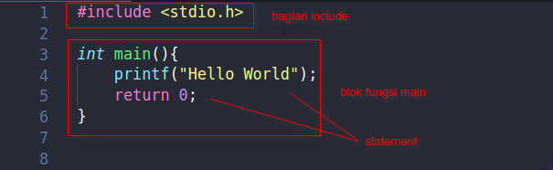

# setup
## install dev c++
- [https://sourceforge.net/projects/orwelldevcpp/files/latest/download](https://sourceforge.net/projects/orwelldevcpp/files/latest/download)

## install mingw
- [https://winlibs.com/](https://winlibs.com/)
  - download in zip and extract
  - and add env variables

## install code block
- http://www.codeblocks.org/downloads/26

# dasar
## run
```c
gcc '.\01 - hello.c' -o '01 - hello.exe'

.\01 - hello.exe
```

## Struktur Dasar Program C


### Apa itu #include?
- Pada program C, #include berfungsi untuk mengimpor fungsi-fungsi yang sudah didefinisikan pada header file.
  - Header file adalah file yang berisi definisi fungsi yang sudah dibuat. Tujuannya agar bisa digunakan pada program C yang lainnya. File ini berekstensi .h, contoh: stdio.h.
  - Pada contoh di atas, kita mengimpor file stdio.h. File ini berisi deklarasi fungsi-fungsi dasar yang kita butuhkan untuk membuat program C, seperti printf().
- File stdio.h sudah ada di dalam komputer kita saat menginstal gcc.
  ```c
  #include <stdio.h>
  ```

### Apa itu Fungsi main()?
- Fungsi main() adalah fungsi utama dalam program. Fungsi ini akan dieksekusi pertama kali saat program dijalankan.
- Karena itu, kita harus menuliskan logika program di dalam fungsi ini.
- Pada contoh di atas kita membuat fungsi main dengan deklarasi seperti ini:
- void artinya tidak ada (kosong). Jika kita menggunakan void, maka kita tidak perlu menuliskan kata kunci return di akhir fungsi. Karena fungsi void tidak akan mengembalikan nilai apapun.
  ```c
  int main() {
    //...
    return 0;
  }

  void main() {
      //...
  }
  ```

## Penulisan Statement
- Statemen adalah perintah-perintah atau fungsi untuk melakukan sesuatu.
  ```c
  printf("Hello World!");
  ```

## Penulisan Blok Kode
- Blok kode adalah kumpulan statement atau ekspresi. Blok kode pada program C dibungkus dengan kurung kurawal { ... }.
  ```c
  if (x == y) {
    // di dalam sini adalah blok kode
    // sampai akhir kurung
  }

  for (int i = 0; i < 10; i++){
      // di dalam sini adalah blok kode
      // sampai akhir kurung
  }
  ```

## Penulisan Komentar
- Komentar adalah bagian yang tidak akan dieksekusi oleh komputer. Komentar bisanya digunakan untuk membuat keterangan pada kode program.
  ```c
  // ini adalah komentar

  #include <stdio.h>

  int main(){
      // ini adalah komentar satu baris
      printf("Hello World!");

      /*
          ini adalah komentar
          yang lebih
          dari satu baris
      */
      return 0;
  }
  ```

## Case Bersifat Sensitive
- Case Sensitive artinya bahasa C akan memperhatikan huruf besar dan huruf kecil dalam penulisan kode.
  ```c
  // misalkan kita membuat variabel seperti ini
  string nama = "Petani";
  string Nama = "Kode";
  ```

- Variabel nama dengan Nama akan dianggap variabel yang berbeda, karena ada yang pakai huruf besar (kapital) dan huruf kecil.
- Biasanya para pemula sering membuat kesalahan dengan case, alhasil program akan error.