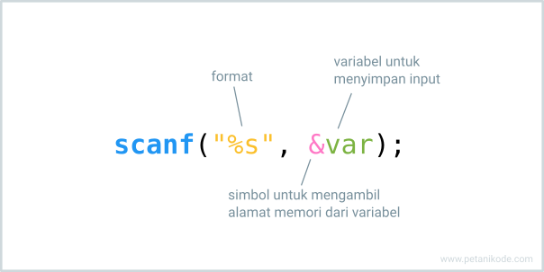
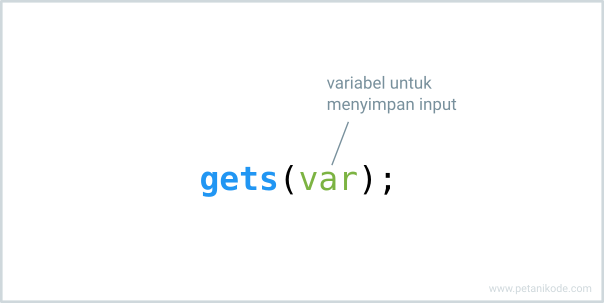

# Fungsi Input dan Output
- Input adalah sesuatu data yang kita masukan ke dalam program.
- Proses adalah langkah-langkah yang harus dilakukan program untuk menghasilkan output.
- Output adalah informasi yang dihasilkan setelah dilakukan proses. Output biasanya ditampilkan ke layar komputer.

## fungsi output
### Fungsi printf()
- Fungsi printf() merupakan fungsi untuk menampilkan output ke layar komputer. Fungsi ini terdapat pada library stdio.h.
  ```c
  #include <stdio.h>

  int main(){
      printf("Hello, ini adalah teks output\n");
      printf("Nama saya %s\n", "Dian");
      printf("Usia saya %d\n", 20);
      return 0;
  }
  ```

- %s adalah simbol untuk menampilkan nilai string;
- %d adalah simbol untuk menampilkan nilai angka atau bilangan desimal;
- \n adalah simbol untuk membuat baris baru.

| Simbol | Arti atau Fungsi                        |
|--------|-----------------------------------------|
| %c     | untuk menampilkan karakter              |
| %s     | untuk menampilkan teks (string)         |
| %d, %i | untuk menampilkan bilangan desimal      |
| %f     | untuk menampilkan bilangan pecahan      |
| %o     | untuk menampilkan bilangan oktal        |
| %x     | untuk menampilkan bilangan heksadesimal |
| \t     | untuk membuat tabs                      |

### Fungsi puts()
- Fungsi puts() adalah fungsi untuk menampilkan output. Fungsi ini juga terdapat pada library stdio.h.
- Perbedaannya dengan printf(), fungsi puts() tidak memerlukan format.
- Fungsi puts() akan selalu membuat baris baru. Jadi tidak perlu menggunakan simbol \n seperti pada printf().
  ```bash
  #include <stdio.h>

  int main(){
      puts("Hello World");
      puts("Nama Saya Dian");
      
      return 0;
  }
  ```

- Selain fungsi puts(), terdapat juga fungsi putchar() yang khusus untuk menampilkan satu karakter saja.
  ```c
  #include <stdio.h>

  int main(){
      putchar('A');

      return 0;
  }
    ```

## Fungsi Input
- Pada bahasa C, terdapat beberapa fungsi untuk mengambil input.
  - Oh iya, input yang akan kita bahas di sini adalah input dari keyboard.
  - Input juga bisa dari file, kamera, mikrofon, dan sebagainya.
  - Tapi kita fokus dulu bahas yang paling mudah…
  - Ini adalah fungsi untuk mengambil input dari keyboard:

### Fungsi scanf()
- Fungsi scanf() adalah fungsi untuk mengambil input dari keyboard. Fungsi ini memiliki format seperti fungsi printf().
  
- Format yang diberikan tergantung dari jenis tipe data apa yang ingin kita ambil.
- Misalnya mau mengambil angka, maka kita bisa pakai %d atau %i.
  ```c
  #include <stdio.h>

  int main () {
      // membuat variabel
      char name[20], web_address[30];

      printf("Nama: ");
      scanf("%s", &name);

      printf("Alamat web: ");
      scanf("%s", &web_address);

      printf("\n------------------------------\n");
      printf("Nama yang diinputkan: %s\n", name);
      printf("Alamat Web yang diinputkan: %s\n", web_address);
    
      return 0;
  }
  ```
- Untuk mengatasi masalah ini, kita bisa ubah format yang digunakan pada scanf() menjadi seperti ini:
  ```c
  printf("Nama: ");
  scanf("%[^\n]s", name);
  ```
- Dalam menggunakan scanf(), kita dianjurkan menggunakan simbol & sebelum nama variabel.
  ```c
  #include <stdio.h>

  void main(){

      int a, b, c;

      printf("Inputkan nilai a: ");
      scanf("%i", &a);

      printf("Inputkan nilai b: ");
      scanf("%i", &b);

      c = a + b;

      printf("Hasil a + b: %i", c);

  }
  ```

### Fungsi gets()
- Fungsi gets() adalah fungsi untuk mengambil input dalam satu baris. Fungsi gets() tidak memerlukan format seperti scanf()
  
  ```c
  #include <stdio.h>

  int main () {
    char name[50], web_address[50];

    printf("Nama: ");
    gets(name);
    
    printf("Alamat web: ");
    gets(web_address);

    printf("You entered: %s\n", name);
    printf("Web address: %s\n", web_address);

    return(0);
  }
  ```
- Mengapa?
- Karena dapat menyebabkan masalah buffer overflow pada program. 1
- Lalu bagaimana solusinya?
- Kita bisa menggunakan:

### Fungsi fgets()
- Fungsi fgets() lebih aman dibandingkan gets(), karena kita bisa menentukan ukuran buffer dan sumber inputan.
- Ukuran buffer adalah batas ukuran panjang string yang diinputkan. Lalu stdin adalah sumber inputan dari keyboard.
- Kita juga bisa mengambil input dari file dengan fgets() dengan memasukkan pointer FILE pada stdin.
  ```c
  #include <stdio.h>

  int main(){
      char name[50], email[50];
      
      printf("Nama: ");
      fgets(name, sizeof(name), stdin);
      
      printf("Email: ");
      fgets(email, sizeof(email), stdin);
    
      printf("\n-------------------------\n");
      printf("Nama anda: %s", name);
      printf("Alamat email: %s", email);
      
      return 0;
  }
  ```