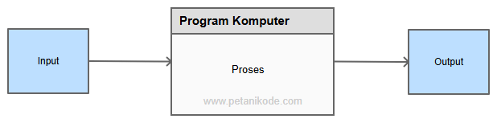

# Variabel, Tipe Data, Konstanta
- Inti dari sebuah program komputer adalah menerima input, melakukan pemrosesan, dan menghasilkan output.
  
- Nilai input bisa kita dapatkan dari keyboard, file, kamera, mikrofon, dan sebagainya.
- Sementara output dapat kita tampilkan ke monitor, cetak ke dokumen, atau ke dalam sebuah file.
- Pada tahap pemrosesan, program membutuhkan bantuan variabel untuk menyimpan nilai sementara.
- Sama seperti waktu kita berpikir… kita akan membutuhkan beberapa ingatan untuk memproses informasi.

## Apa itu Variabel dan Tipe Data?
- Variabel adalah sebuah tempat menyimpan sebuah nilai. Sementara tipe data adalah jenis nilai yang akan tersimpan dalam variabel.
  ```c
  x = 3;
  y = 4;
  ```

- Anggap saja variabel itu sebuah wadah, lalu tipe data itu jenis-jenis benda yang akan disimpan dalam wadah tersebut.

## Bagaimana Cara Membuat Variabel pada Bahasa Pemrograman C?
- Jadi, pertama kita harus menuliskan tipe data lalu diikuti dengan nama variabelnya.
  ```c
  int tinggi;
  ```

- Artinya:
  - Kita akan membuat variabel dengan nama tinggi dan tipe datanya adalah int (integer).
  - Jangan lupa, di setiap pembuatan variabel harus diakhiri dengan titik koma.
- Oh iya, saat membuat variabel…
- …kita juga dapat mengisi langsung dengan nilai yang ingin kita simpan.
  ```c
  int berat = 49;
  ```
- Artinya:
  - Kita akan membuat variabel dengan nama berat dan tipe data integer, lalu langsung diisi dengan nilai 49.

## Aturan Penulisan Variabel pada C
- Ada beberapa aturan penulisan variabel yang harus kamu ketahui:
  - Nama variabel tidak boleh didahului dengan simbol dan angka.
  - Nama variabel tidak boleh menggunakan kata kunci yang sudah ada pada bahasa C, contoh: if, int, void, dll.
  - Nama variabel bersifat case sensitive, artinya huruf besar dan kecil dibedakan, contoh: nama dan Nama adalah dua variabel yang berbeda.
  - Disarankan menggunakan underscore untuk nama variabel yang terdiri dari dua suku kata, contoh: nama_lengkap.

## Contoh Program dengan Variabel
```c
#include <stdio.h>

int main(){
    // membuat variabel dengan tipe data integer
    int berat;
    // membuat variabel dan langsung mengisinya
    int tinggi = 178;

    // mengisi nilai ke variabel
    berat = 54;

    // mencetak isi variabel ke layar
    printf("Berat badan saya adalah %ikg dan tinggi %icm", berat, tinggi);

    return 0;
}
```

- Apa yang akan terjadi jika kita lupa mengisi nilai variabel.
  - Misalnya di bagian pengisian nilai untuk variabel berat kita hapus seperti ini.
    ```c
    // berat = 54;
    ```
- Maka hasil outputnya:
  ```Berat badan saya adalah 0kg dan tinggi 178cm```
- Isi dari variabel berat akan sama dengan nol 0, karena kita tidak mengisinya.
- Ini adalah nilai default yang diberikan.