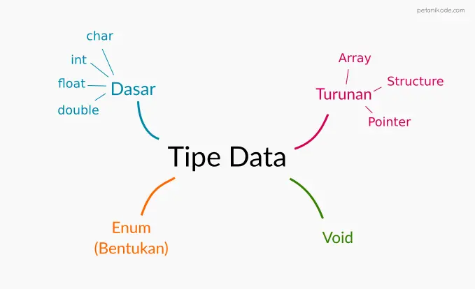

# Tipe Data pada Bahasa C
- Tipe data adalah jenis data…
- Menurut Wikipedia:
  - “Tipe data atau kadang disingkat dengan ‘tipe’ saja adalah sebuah pengelompokan data untuk memberitahu compiler atau interpreter bagaimana programmer ingin mengolah data tersebut” 1
  
## Ada delapan jenis tipe data pada C:
1. Char
2. Integer
3. Float
4. Array
5. Structure
6. Pointer
7. Enum
8. Void

- Apabila kita kelompokkan, maka akan terdapat empat kelompok tipe data.
  

## Tipe Data Dasar pada C
- Sesuai namanya, tipe data dasar adalah tipe data yang paling dasar dalam bahasa pemrograman C.
1. Char: adalah tipe data yang berisi 1 huruf atau 1 karakter;
2. Integer: adalah tipe data yang berupa angka;
3. Float: adalah tipe data yang berupa bilangan pecahan
4. Double: adalah tipe data sama seperti float, namun double memiliki ukuran penyimpanan yang lebih besar dibandingkan float.

| Tipe Data | Ukuran                                  | Panjang                                              | Contoh         |
|-----------|-----------------------------------------|------------------------------------------------------|----------------|
| char      | 1 byte                                  | -128 — 127 atau 0 — 255                              | 'A', 'a', '3'  |
| int       | 2 byte                                  | -32,768 — 32,767 atau -2,147,483,648 — 2,147,483,647 | 32, 1, 4       |
| float     | 4 byte                                  | 1.2E-38 — 3.4E+38                                    | 4.3, 2.2, 6.0  |
| double    | 8 byte                                  | 2.3E-308 — 1.7E+308                                  | 4.2, 4.22, 3.2 |

- Format penulisan koma untuk tipe data float dan double menggunakan tanda titik, mengikuti format internasional.
- Jika kamu menulis seperti ini 2,5 maka akan salah. Penulisan yang benar adalah 2.5.
- Lalu untuk penulisan tipe data char harus diapit dengan tanda petik.
- Mengapa?
  - Karena kalau misalnya karakter itu adalah spasi—tanpa tanda petik—kita tidak akan bisa mengisinya dengan karakter spasi.

### contoh
```c
#include <stdio.h>

int main(){
    int usia = 19;
    float berat = 65.3;
    double tinggi = 178.43;
    char jenis_kelamin = 'L';

    printf("Usia: %i tahun\n", usia);
    printf("Tinggi: %.2f cm\n", tinggi);
    printf("Berat: %.2f Kg\n", berat);
    printf("Jenis kelamin: %c\n", jenis_kelamin);

    return 0;
}
```

- Mungkin kamu akan bertanya:
- Mengapa kita menggunakan %.2f pada saat mencetak tipe data float dan double?
- Kita bisa saja mencetaknya dengan format %f saja, akan tetapi akan dicetak dengan angka yang panjang.
  ```bash
  Tinggi: 178.430000 cm
  Berat: 65.300003 Kg
  ```
- Kita menggunakan %.2f untuk menentukan batas jumlah angka setelah koma. Angka 2 sebelum f artinya dua angka di belakang koma.
  ```bash
  Tinggi: 178.43 cm
  Berat: 65.30 Kg
  ```

## Tipe Data Void pada C
- Tipe data void adalah tipe data khusus untuk menyatakan tidak ada data.
- Apakah nol 0 sama dengan void?
  - Tidak, nol memiliki nilai yaitu 0 sementara void tidak ada.
- Bingung?
- Coba bayangkan seperti ini:
  
- Nol 0 artinya tisunya habis, null atau void artinya tisunya tidak ada. Lalu undefined artinya variabelnya belum dibuat dalam memori.
- Biasanya, undefined akan kamu temukan saat belajar Javascript.
- Tipe data void jarang digunakan dalam pembuatan variabel. Tapi biasanya dipakai pada nilai kembalian sebuah fungsi.
  ```c
  void main(){
    //...
  }
  ```

## Konversi Tipe Data
- Konversi tipe data atau type casting adalah proses mengubah tipe data menjadi tipe yang lain.
- Kenapa kita perlu konversi tipe data?
- Untuk menjawabnya, saya ingin tunjukan ilustrasi berikut ini:
  
- Air yang bentuknya cair tidak bisa disimpan dalam kardus. Karena itu, air harus konversi dulu menjadi bentuk padat (es) agar bisa disimpan dalam kard
- Begitu juga dengan variabel…
  - Cara mengubah tipe data pada C, cukup dengan menuliskan nama tipe datanya di depan nilai atau variabel yang ingin diubah.
- float a = (float) 10;
- Artinya nilai 10 akan diubah menjadi tipe float.

### contoh
```c
#include <stdio.h>

void main(){
    int a = 5;
    int b = 2;

    float c = a / b;

    printf("Hasil a / b = %.2f\n", c);
}
```

- Program di atas akan menghasilkan output:
  ```Hasil a / b = 2.00```
- Mengapa 2.00? bukannya 2.50?
- Ini disebabkan karena variabel a dan b bertipe integer. Nah hasil pembagian dari tipe data integer akan selalu dibulatkan.
- Agar tidak dibulatkan, kita harus mengubahnya menjadi float. Kemudian melakukan pembagian.
  ```
  float c = (float) a / (float) b;
  ```

## Mengenal Konstanta pada C
- Konstanta adalah sebuah nilai tetapan.
- Bisa juga dibilang sebagai variabel yang tidak bisa diubah nilainya.
- Ada dua cara pembuatan konstanta pada C:
  - Menggunakan #define;
  - dan Menggunakan const.

### Contoh menggunakan define:
```c
#include <stdio.h>
#define SEPULUH  10 
#define VERSI  4.5 
#define JENIS_KELAMIN 'L' 

void main(){
    printf("isi konstanta SEPULUH adalah %i\n", SEPULUH);
    printf("isi konstanta VERSI adalah %f\n", VERSI);
    printf("isi konstanta JENIS_KELAMIN adalah %c\n", JENIS_KELAMIN);
}

// isi konstanta SEPULUH adalah 10
// isi konstanta VERSI adalah 4.500000
// isi konstanta JENIS_KELAMIN adalah L
```

### Contoh menggunakan const:
```c
#include <stdio.h>

void main(){
    const double PI = 3.14;
    const char JENIS_KELAMIN = 'P';
    const int VERSI = 11;

    printf("isi konstanta PI adalah %f\n", PI);
    printf("isi konstanta JENIS_KELAMIN adalah %c\n", JENIS_KELAMIN);
    printf("isi konstanta VERSI adalah %i\n", VERSI);
}

// isi konstanta PI adalah 3.140000
// isi konstanta JENIS_KELAMIN adalah P
// isi konstanta VERSI adalah 11
```

- Perbedaan pembuatan konstanta yang menggunakan #define dan const terletak pada format penulisannya.
- Pada #define kita tidak perlu menuliskan tipe data, sedangkan const harus.
- Pada #define kita tidak membutuhkan titik koma di akhir, sedangkan pada const kita harus menuliskan titik koma.
- Posisi penulisan untuk #define dan const bisa ditulis di dalam main() maupun di luar.
- Oh iya, untuk nama konstanta disarankan menggunakan huruf kapital untuk menandakan itu sebuah konstanta.
- Apa yang akan terjadi jika saya mencoba mengisi nilai ke dalam konstanta?
- Ya programnya akan error.

# Operator yang Harus diketahui pada C
## Apa itu Operator?
- Operator adalah sebuah Simbol yang digunakan untuk melakukan operasi tertentu.
- Misalnya: Kita ingin menjumlahkan nilai dari variabel x dan y, maka kita bisa menggunakan operator penjumlahan (+).
  - x + y

## Ada enam jenis kelompok operator dalam pemrograman C:
1. Operator Aritmatika;
2. Operator Penugasan;
3. Operator Pembanding;
4. Operator Logika;
5. Operator Bitwise;
6. dan Operator Lain-lain.

## Operator Aritmatika
- Operator aritmatika merupakan operator yang digunakan untuk melakukan operasi aritmatika.

| Nama Operator | Simbol |
|:-------------:|:------:|
|  Penjumlahan  |    +   |
|  Pengurangan  |    -   |
|   Perkalian   |    *   |
|   Pembagian   |    /   |
|   Sisa Bagi   |    %   |

### contoh
```c
#include <stdio.h>

void main(){

    int a, b, c;

    printf("Inputkan nilai a: ");
    scanf("%i", &a);

    printf("Inputkan nilai b: ");
    scanf("%i", &b);

    c = a + b;

    printf("Hasil a + b: %i", c);

}
```

- Pada operasi pembagian, 7/2 hasilnya adalah 3.
- Mengapa demikian? Bukannya seharusnya 3.5…
- Ini karena kita melakukan operasi terhadap tipe data integer.
  - Bila kita ubah programnya menggunakan tipe data float:

## Operator Penugasan
- Operator penugasan (Assignment Operator) merupakan operator untuk memberikan tugas pada variabel. Biasanya untuk mengisi nilai.

| Nama Operator             | Sombol |
|---------------------------|--------|
| Pengisian Nilai           | =      |
| Pengisian dan Penambahan  | +=     |
| Pengisian dan Pengurangan | -=     |
| Pengisian dan Perkalian   | *=     |
| Pengisian dan Pembagian   | /=     |
| Pengisian dan Sisa bagi   | %=     |
| Pengisian dan shift left  | <<=    |
| Pengisian dan shift right | >>=    |
| Pengisian dan bitwise AND | &=     |
| Pengisian dan bitwise OR  | \|=    |
| Pengisian dan bitwise XOR | ^=     |

### contoh
```c
#include <stdio.h>

void main(){
    int a, b;

    // pengisian nilai dengan operator =
    a = 5;
    b = 10;

    // pengisian sekaligus penambahan
    b += a; // ini sama seperti b = b + a
    printf("Hasil b += a adalah %d\n", b);

    // pengisian sekaligus pengurangan
    b -= a; // ini sama seperti b = b - a
    printf("Hasil b -= a adalah %d\n", b);

    // pengisian sekaligus perkalian
    b *= a; // ini sama seperti b = b * a
    printf("Hasil b *= a adalah %d\n", b);

    // pengisian sekaligus pembagian
    b /= a; // ini sama seperti b = b / a
    printf("Hasil b /= a adalah %d\n", b);

    // pengisian sekaligus sisa bagi
    b %= a; // ini sama seperti b = b % a
    printf("Hasil b %= a adalah %d\n", b);
}
```

## Operator Pembanding
- Operator pembanding adalah operator untuk membandingkan dua buah nilai. Operator ini juga dikenal dengan operator relasi.

|      Nama Operator      | Simbol |
|:-----------------------:|:------:|
|       Lebih Besar       |    >   |
|       Lebih Kecil       |    <   |
|       Sama Dengan       |   ==   |
|    Tidak Sama dengan    |   !=   |
| Lebih Besar Sama dengan |   >=   |
| Lebih Kecil Sama dengan |   <=   |

- Nilai yang dihasilkan dari operasi pembanding akan berupa true dan false.
- Pada bahasa C, nilai true akan sama dengan 1 dan false akan sama dengan 0.

### contoh
```c
#include <stdio.h>

void main(){
    int a = 4;
    int b = 3;

    printf("a = %d\n", a);
    printf("b = %d\n", b);
    // operator pembanding
    printf("a > b = %d\n", a > b);
    printf("a < b = %d\n", a < b);
    printf("a >= b = %d\n", a >= b);
    printf("a <= b = %d\n", a <= b);
    printf("a == b = %d\n", a == b);
    printf("a != b = %d\n", a != b);
}
```

## Operator Logika
- Kalau kamu pernah belajar logika matematika, pasti tidak akan asing dengan operator ini.

|   Nama Operator  | Simbol di Java |
|:----------------:|:--------------:|
|    Logika AND    |       &&       |
|     Logika OR    |      \|\|      |
| Negasi/kebalikan |        !       |

- Operator Logika digunakan untuk membuat operasi logika.
- Misalnya seperti ini:
  - Pernyataan 1: Petani Kode seorang programmer
  - Pernyataan 2: Petani Kode menggunakan Linux
- Jika ditanya, apakah Petani Kode programmer yang menggunakan Linux?
- Tentu kita akan cek dulu kebenarannya
  - Pernyataan 1: Petani Kode seorang programmer = true.
  - Pernyataan 2: Petani Kode menggunakan Linux = true.
- Apa petanikode programmer dan menggunakan Linux?
- Pernyataan 1 && Pernyataan 2 = true

| Pernyataan 1 | Pernyataan 2 | Logika AND |
|:------------:|:------------:|:----------:|
|     true     |     true     |    true    |
|     true     |     false    |    false   |
|     false    |     true     |    false   |
|     false    |     false    |    false   |

### contoh
```c
#include <stdio.h>

void main(){
    int a = 1; // true
    int b = 0; // false

    printf("a = %d\n", a);
    printf("b = %d\n", b);

    // logika AND
    printf("a && b = %d\n", a && b);

    // logika OR
    printf("a || b = %d\n", a || b);

    // logika NOT
    printf("!a = %d\n", !a);
}
```

## Operator Bitwise
- Operator bitwise merupakan operator yang digunakan untuk operasi berdasarkan bit (biner) dari sebuah nilai.

| Nama Operator | Simbol di Java |
|:-------------:|:--------------:|
|      AND      |        &       |
|       OR      |       \|       |
|      XOR      |        ^       |
| NOT/komplemen |        ~       |
|   Left Shift  |       <<       |
|  Right Shift  |       >>       |

- Buat kamu yang sudah pernah belajar sistem bilangan dan sistem digital akan mudah memahami cara kerja operator ini.
-  Tapi buat kamu yang belum… Saya akan coba menjelaskan dengan cara yang mudah.
- Misalkan kita punya nilai 6 dan 3.
- Nilai 6 dan 3 kemudian kita ubah ke dalam bentuk bilangan biner.
- Sehingga akan menjadi seperti ini:
  ```bash
  6 = 0110
  3 = 0011
  ```
- Nah, operator bitwise akan melakukan operasi berdasarkan biner-biner tersebut.

### Bitwise AND (&)
- Bitwise AND merupakan operasi bit berdasarkan logika AND, perhatikan gambar ini.
  
- Perhatikan bilangan biner untuk nilai 6 dan 3.
- Apabila kita melakukan operasi AND di sana, maka akan menghasilkan bilangan biner baru.
- Kemudian biner yang dihasilkan tersebut diubah kembali ke dalam bilangan desimal.
  - Maka hasilnya adalah 2.

### contoh
```c
#include <stdio.h>

void main(){
    int a = 6;
    int b = 3;

    printf("a & b = %d\n", a & b);
}
```

### Bitwise OR (|)
- Operator bitwise OR juga sama seperti bitwise AND.
- Operator bitwise OR akan menghasilkan nilai false atau 0 saat keduanya false.
  

### contoh
```c
#include <stdio.h>

void main(){
    int a = 6;
    int b = 3;

    printf("a | b = %d\n", a | b);
}

// output: a | b = 7
```

### Bitwise XOR (^)
- Operator XOR (Exclusive OR) akan menghasilkan nilai 1 saat kedua nilai tidak sama.

### contoh
```c
#include <stdio.h>

void main(){
    int a = 6;
    int b = 3;

    printf("a & b = %d\n", a ^ b);
}

// output: a ^ b = 5
```

### Bitwise NOT (~)
- Bitwise NOT dikenal juga dengan komplemen.
- Operator ini akan menghasilkan nilai biner yang terbalik dari biner aslinya.
- Kemudian direpresentasikan dengan [komplemen dua.](https://en.wikipedia.org/wiki/Two%27s_complement)
  

### contoh
```c
#include <stdio.h>

void main(){
    int a = 6;

    printf("~a = %d\n", ~a);
}

// ~a = -7
```

### Bitwise Left Shift (<<)
- Operator bitwise left shift akan menghasilkan nilai biner yang digeser ke kiri.
  ```
  6 << 1
  ```
- Maka nilai biner dari 6 akan digeser sebanyak 1 bit ke arah kiri.
  

### contoh
```c
#include <stdio.h>

void main(){
    int a = 6;

    printf("a << 1 = %d\n", a << 1);
}

// a << 1 = 12
```

### Bitwise Right Shift (>>)
- Bitwise right shift sama seperti left shift. Perbedaannya terletak pada arahnya.
- Right shift akan menggeser bit ke arah kanan.
  ```bash
  6 >> 1
  ```
- Maka nilai biner dari 6 akan digeser ke arah kanan sebanyak 1 bit.
  

### contoh
```c

#include <stdio.h>

void main(){
    int a = 6;

    printf("a >> 1 = %d\n", a >> 1);
}

// a >> 1 = 3
```

## Operator Lain-lain
- Selain dari operator yang kita bahas di atas, terdapat beberapa operator lain yang harus diketahui:

| Nama Operator | Simbol | Keterangan                    |
|---------------|--------|-------------------------------|
| Alamat memori | &      | untuk mengambil alamat memori |
| Pointer       | *      | untuk membuat pointer         |
| Ternary       | ? :    | untuk membuat kondisi         |
| Increment     | ++     | untuk menambah 1              |
| Decrement     | --     | untuk mengurangi 1            |

- Operator & jika digunakan pada satu variabel, akan berfungsi untuk mengambil alamat memori dari variabel tersebut.
- Dan operator * kan berfungsi untuk membuat sebuah pointer.

### contoh 1
```c
#include <stdio.h>

void main(){
    // membuat pointer
    int *a = 5;

    // ambil alamat memori dari pointer a
    printf("alama memori variabel a adalah %x\n", &a);
}
```

### contoh 2
- Berikutnya ada operator ternary untuk membuat kondisi. Cara kerjanya seperti percabangan if/else.
  

```c
#include <stdio.h>

void main(){
    int a = 4;

    printf("a > 1 adalah %s", a > 1 ? "benar": "salah");
}

// a > 1 adalah benar
```

### contoh 3
- Terakhir ada operator increment dan decrement untuk menambah dan mengurangi nilai dengan 1.

```c
#include <stdio.h>

void main(){
    int a = 4;

    // increment a
    a++;

    printf("a++ = %d\n", a);

    // increment a
    ++a;

    printf("++a = %d\n", a);

    // decrement a
    a--;

    printf("a-- = %d\n", a);

    // decrement a
    --a;

    printf("--a = %d\n", a);
}

// a++ = 5
// ++a = 6
// a-- = 5
// --a = 4
```

- Operator increment dan decrement dapat ditaruh di depan maupun di belakang variabel atau nilai.
- Operator ini biasanya digunakan pada blok perulangan.