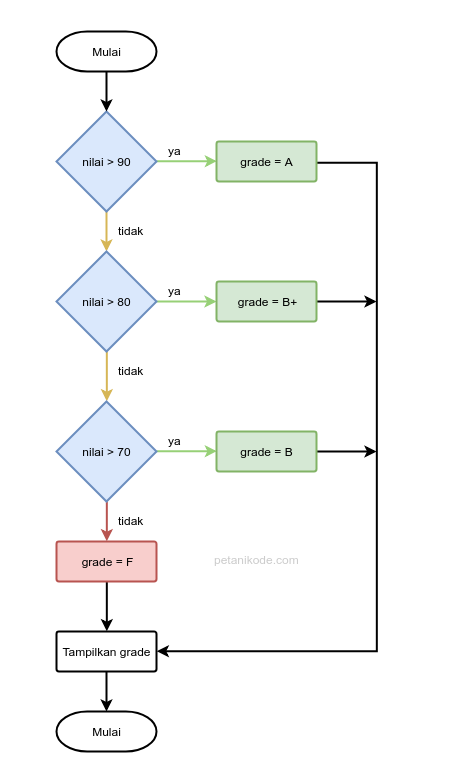

# Blok Percabangan
## Percabangan if
- Percabangan if merupakan percabangan yang hanya memiliki satu blok pilihan saat kondisi bernilai benar.

### contoh
```c
#include <stdio.h>

void main(){
    printf("== Program Pembayaran ==\n");
    int total_belanja = 0;

    printf("Inputkan total belanja: ");
    scanf("%i", &total_belanja);

    // menggunakan blok percabangan if
    if( total_belanja > 100000 ){
        printf("Selamat, Anda mendapatkan hadiah!\n");
    }

    printf("Terima kasih sudah berbelanja di toko kami\n\n");
}
```

## Percabangan if/else
- Percabangan if/else merupakan percabangan yang memiliki dua blok pilihan.
- Blok pilihan pertama untuk kondisi benar, dan pilihan kedua untuk kondisi salah (else).

### contoh
```c
#include <stdio.h>

void main(){
    // membuat array karakter untuk menyimpan password
    char password[30];

    printf("==== Program Login ====\n");
    printf("Masukan password: ");
    scanf("%s", &password);

    // percabangan if/else
    if( strcmp(password, "kopi") == 0 ){
        printf("Selamat datang bos!\n");
    } else {
        printf("Password salah, coba lagi!\n");
    }

    printf("Terima kasih sudah menggunakan aplikasi ini!\n");
}
```

- Fungsi strcmp() akan menghasilkan nilai false atau nol (0) jika kedua teks yang dibandingkan sama.
- Oleh sebab itu, kita menggunakan perbandingan seperti ini…
  ```c
  strcmp(password, "kopi") == 0
  ```
  - pada blok if/else.

## Percabangan if/else/if
- Percabangan if/else/if merupakan percabangan yang memiliki lebih dari dua blok pilihan.
  

### contoh
```c
#include <stdio.h>

void main(){
    int nilai;
    char grade;

    printf("=== Program Grade Nilai ===\n");
    printf("Inputkan nilai: ");
    scanf("%i", &nilai);

    // menggunakan percabangan if/else/if
    if (nilai >= 90) {
        grade = 'A';
    } else if (nilai >= 80) {
        grade = 'B'; // seharusnya B+
    } else if (nilai >= 70) {
        grade = 'B';
    } else if (nilai >= 60) {
        grade = 'C'; // seharusnya C+
    } else if (nilai >= 50) {
        grade = 'C';
    } else if (nilai >= 40) {
        grade = 'D';
    } else if (nilai >= 30) {
        grade = 'E';
    } else {
        grade = 'F';
    }

    printf("Nilai: %i\n", nilai);
    printf("Grade anda: %c\n", grade);
}
```

- Perhatikan di bagian else if untuk >= 80 dan >= 60, seharusnya di sana kita mengisi variabel grade dengan B+ dan C+.
- Tapi kita mengisinya dengan B dan C saja.
- Ini karena variabel tersebut bertipe char dan tipe data ini hanya mampu menyimpan satu karakter saja.
- Jika ingin menggunakan B+ dan C+, kita bisa pakai tipe data string.

## Percabangan Switch/Case
- Percabangan switch/case adalah bentuk lain dari percabangan if/else/if.
- strukturnya seperti ini
  ```c
  switch(variabel){
    case <value>:
        // blok kode
        break;
    case <value>:
        // blok kode
        break;
    default:
        // blok kode
  }
  ```
- Kita dapat membuat blok kode (case) sebanyak yang diinginkan di dalam blok switch.
- Pada <value>, kita bisa isi dengan nilai yang nanti akan dibandingkan dengan variabel.
- Setiap case harus diakhiri dengan break. Khusus untuk default, tidak perlu diakhiri dengan break karena dia terletak di bagian akhir.
- Pemberian break bertujuan agar program berhenti mengecek case berikutnya saat sebuah case terpenuhi.

### contoh
```c
#include <stdio.h>

void main(){

    char grade;

    printf("Inputkan grade: ");
    scanf("%c", &grade);

    switch (toupper(grade)){
        case 'A':
            printf("Luar biasa!\n");
            break;
        case 'B':
        case 'C':
            printf("Bagus!\n");
            break;
        case 'D':
            printf("Anda lulus\n");
            break;
        case 'E':
        case 'F':
            printf("Anda remidi\n");
            break;
        default:
            printf("Grade Salah!\n");
    }
}
```

- Perhatikan program di atas…
- Kita menggunakan fungsi toupper() untuk mengubah huruf kecil menjadi huruf kapital atau huruf besar.
  ```c
  switch (toupper(grade)){
    ...
  }
  ```
- Mengapa menggunakan toupper()?
  - Ini karena agar kita dapat menginputkan huruf kecil dan huruf besar untuk mengecek grade.
- Berikutnya coba perhatikan case 'B' dan case 'E'.
  - Kedua case ini tidak memiliki isi.
  - Ini artinya…dia akan mengikut pada case berikutnya.
- Sebagai contoh, apabila kita inputkan B maka case C yang akan terpilih.
  - Begitu juga saat kita inputkan E, maka case F yang akan terpilih.

## Percabangan dengan Operator Ternary
- Percabangan menggunakan operator ternary merupakan bentuk lain dari percabangan if/else.
- Bisa dibilang: Bentuk singkatnya dari if/else.
  - Operator ternary juga dikenal dengan sebutan operator kondisi (conditional operator).
- Bentuk strukturnya seperti ini:
  ```c
  (kondisi) ? true : false
  ```
- Bagian kondisi dapat kita isi dengan ekspresi yang menghasilkan nilai true dan false.
- Lalu setelah tanda tanya ? adalah bagian pilihan.
- Jika kondisi bernilai benar, maka true yang akan dipilih. Tapi kalau salah, maka false yang akan dipilih.

### contoh
```c
#include <stdio.h>

void main(){

    int jawaban;

    printf("Berapakah hasil 3+4?\n");
    printf("jawab> ");
    scanf("%d", &jawaban);

    printf("Jawaban anda: %s\n", (jawaban == 7) ? "Benar" : "Salah");

}
```

- Coba perhatikan pada baris ini:
  ```c
    printf("Jawaban anda: %s\n", (jawaban == 7) ? "Benar" : "Salah");
    Di sana kita menggunakan operator ternary untuk membuat kondisi if/else.
  ```
- Jika tidak menggunakan operator ternary, akan menjadi seperti ini:
  ```c
    if( jawaban == 7 ){
        printf("Jawaban anda: Benar\n");
    } else {
        printf("Jawaban anda: Salah\n");
    }
  ```

## Percabangan Bersarang (Nested)
- Semua bentuk blok percabangan di atas dapat kita buat di dalam percabangan yang lainnya.
- Ini disebut dengan percabangan bersarang atau nested if.

### contoh
```c
#include <stdio.h>

void main(){
    char username[30], password[30];

    printf("=== Welcome to Awesome Program ===\n");
    printf("Username: ");
    scanf("%s", &username);
    printf("Password: ");
    scanf("%s", &password);

    if(strcmp(username, "petanikode") == 0){
        if(strcmp(password, "kopi") == 0){
            printf("Selamat datang bos!\n");
        } else {
            printf("Password salah, coba lagi!\n");
        }
    } else {
        printf("Anda belum terdaftar\n");
    }

}
```