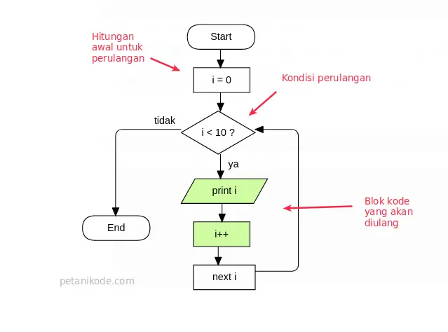
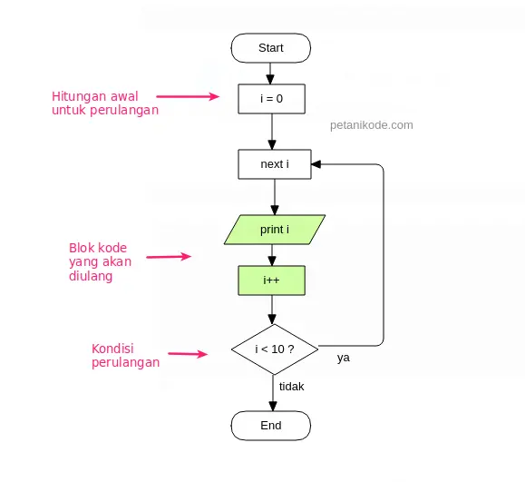

# Perulangan
## Counted Loop
- merupakan perulangan yang jelas dan sudah tentu banyak kali perulangannya.
- Perulangan yang termasuk dalam Counted Loop:
  - Perulangan For

## Uncounted Loop
- merupakan perulangan yang tidak jelas berapa kali ia harus mengulang.
- Perulangan yang termasuk dalam Uncounted Loop:
  - Perulangan While
  - Perulangan Do/While

---
## Perulangan For
- Perulangan for merupakan perulangan yang termasuk dalam counted loop, karena sudah jelas berapa kali ia akan mengulang.
  
  ```c
  for(int i = 0; i < 10; i++){
    printf("Perulangan ke-%i\n", i);
  }
  ```
- Yang perlu diperhatikan adalah kondisi yang ada di dalam kurung setelah kata for.
- Kondisi ini akan menentukan:
  - Hitungan akan dimulai dari 0 (i = 0);
  - Hitungannya sampai berapa? Sampai i < 10;
  - Lalu di setiap perulangan i akan bertambah +1 (i++).
- Variabel i pada perulangan for berfungsi untuk menyimpan nilai hitungan.
- Jadi setiap perulangan dilakukan nilai i akan selalu bertambah satu. Karena kita menentukannya di bagian i++.

### contoh 1
```c
#include <stdio.h>

void main(){
    for(int i = 0; i < 10; i++){
        printf("Perulangan ke-%i\n", i);
    }
}
```

- Apakah nama variabelnya harus selalu i?
  - Tidak.
- Kita juga bisa menggunakan nama lain.

### contoh 2
```c
#include <stdio.h>

void main(){
    for(int counter = 0; counter < 50; counter+=2){
        printf("Perulangan ke-%i\n", counter);
    }
}
```

- Pada contoh tersebut, kita melakukan perulangan dimulai dari nol 0. Lalu di setiap perulangan nilai variabel counter akan ditambah 2 (counter+2).

- Bagaimana kalau counter perulangannya dimulai dari angka yang lebih besar sampai yang ke paling kecil?
- Ini biasanya kita buat saat ingin menghitung mundur…
- Caranya gampang.
- Kita tinggal isi nilai counter dengan nilai terbesarnya.
  - Misalnya kita akan mulai hitungan dari 10 sampai ke 0.
- Maka nilai counter, kita isi awalnya dengan 10.
- Lalu di kondisi perbandingannya, kita berikan counter > 0. Artinya perulangan akan dilakukan selama nilai counter lebih besar dari 0.
- Lalu kita kurangi (-1) nilai counter di setiap perulangan (counter--).

### contoh 3
```c
for(int counter = 10; counter > 0; counter--){
    printf("Perulangan ke-%i\n", counter);
}
```

- Mengapa tidak sampai nol (0)?
- Karena kondisi yang kita berikan counter > 0. Apabila counter bernilai 0, maka kondisi ini akan menjadi false.
- Kecuali kita menggunakan operator lebih besar sama dengan (>=), maka jika counter bernilai 0, kondisi akan menjadi true.

## Perulangan While
- Perulangan while merupakan perulangan yang termasuk dalam perulangan uncounted loop.
- Perulangan while juga dapat menjadi perulangan yang counted loop dengan memberikan counter di dalamnya.
  

### contoh
```c
#include <stdio.h>

void main(){
    char ulangi = 'y';
    int counter = 0;

    // perulangan while
    while(ulangi == 'y'){
        printf("Apakah kamu mau mengulang?\n");
        printf("Jawab (y/t): ");
        scanf(" %c", &ulangi);

        // increment counter
        counter++;
    }

    printf("\n\n----------\n");
    printf("Perulangan Selesai!\n");
    printf("Kamu mengulang sebanyak %i kali.\n", counter);
}
```

- Coba perhatikan blok kode while:
  ```c
  // perulangan while
  while(ulangi == 'y'){
      printf("Apakah kamu mau mengulang?\n");
      printf("Jawab (y/t): ");
      scanf(" %c", &ulangi);
      // increment counter
      counter++;
  }
  ```
- Di sana… Perulangan akan terjadi selama variabel ulangi bernilai y.
- Lalu kita menggunakan fungsi scanf() untuk mengambil input.
- Selama kita menjawab y pada input, maka perulangan akan terus dilakukan.
- Tapi kalau kita jawab yang lain, maka perulangan akan dihentikan.
- Karena kondisi perulangannya tidak terpenuhi.

## Perulangan Do/While
- Perulangan do/while sama seperti perulangan while.
- Perbedaannya:
- Perulangan do/while akan melakukan perulangan sebanyak 1 kali terlebih dahulu, lalu mengecek kondisi yang ada di dalam kurung while.
      
  ```c
  do {
    // blok kode yang akan diulang
  } while (<kondisi>);
  ```

- Jadi perbedaannya:
- Perulangan do/while akan mengecek kondisi di belakang (sesudah mengulang), sedangkan while akan mengecek kondisi di depan atau awal (sebelum mengulang).

### contoh
```c
#include <stdio.h>

void main(){

    char ulangi = 'y';
    int counter = 0;

    do {
        printf("Apakah kamu mau mengulang?\n");
        printf("Jawab (y/t): ");
        scanf(" %c", &ulangi);

        // increment counter
        counter++;
    } while(ulangi == 'y');

    printf("\n\n----------\n");
    printf("Perulangan Selesai!\n");
    printf("Kamu mengulang sebanyak %i kali.\n", counter);
}
```

- Contoh tersebut sama seperti contoh pada perulangan while.
- Saat perulangan pertama, cobalah untuk membatalkan perulangannya dengan menjawab t.

## Perulangan Bersarang (Nested Loop)
- Di dalam blok perulangan, kita juga dapat membuat perulangan.
- Ini disebut dengan nested loop atau perulangan bersarang atau perulangan di dalam perulangan.

### contoh
```c
#include <stdio.h>

void main(){
    for(int i = 0; i < 10; i++){
        for(int j = 0; j < 10; j++){
            printf("Perulangan ke (%d, %d)\n", i, j);
        }
    }
}
```

- Pada perulangan tersebut, kita menggunakan dua perulangan for.
- Perulangan pertama menggunakan variabel i sebagai counter, sedangkan perulangan kedua menggunakan variabel j sebagai counter.