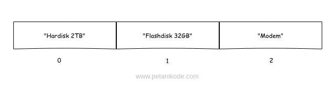
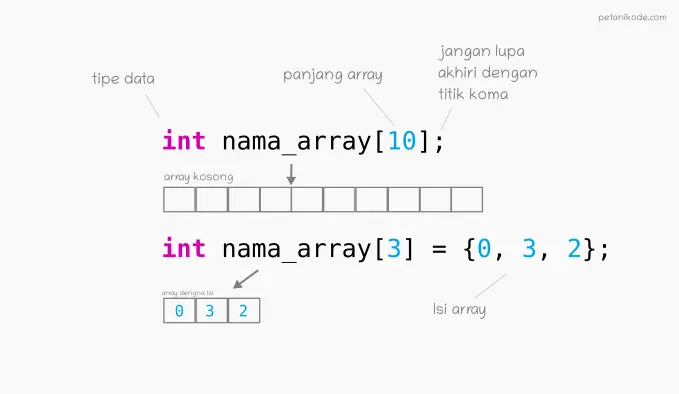
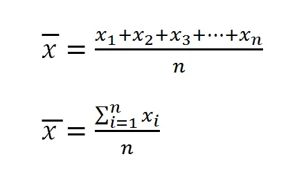

# Struktur Data Array
- Apa yang akan kamu lakukan jika diminta untuk menyimpan banyak data di program?
- Misalkan kita ingin menyimpan nama-nama teman untuk data kontak.
- Mungkin saja, kita akan menyimpannya seperti ini:
  ```c
  char[32] namaKontak1 = "Ayu";
  char[32] namaKontak2 = "Bunga";
  char[32] namaKontak3 = "Cyntia";
  char[32] namaKontak4 = "Deni";
  char[32] namaKontak5 = "Elisa";
  ```

- Hal ini boleh-boleh saja.. Akan tetapi, masalahnya:
  - “Gimana nanti kalau ada banyak sekali data, pasti capek bikin variabel terus?”
- Karena itu, kita membutuhkan Array.
- Apa itu Array, dan bagaimana cara menggunakannya?

## Apa itu Array?
- Array merupakan struktur data yang digunakan untuk menyimpan sekumpulan data dalam satu tempat.
- Setiap data dalam Array memiliki indeks, sehingga kita akan mudah memprosesnya.
  
- Indeks array selalu dimulai dari angka nol (0).
- Pada teori struktur data…
  - …Ukuran array akan bergantung dari banyaknya data yang ditampung di dalamnya.

## Cara Membuat Array pada C
- Pada pemrograman C, array dapat kita buat dengan cara seperti ini.
  ```c
  // membuat array kosong dengan tipe data integer dan panjang 10
  int nama_array[10];

  // membuat array dengan langsung diisi
  int nama_arr[3] = {0, 3, 2}
  ```

- Cara membuat array hampir sama seperti cara membuat variabel biasa.
- Bedanya… pada array kita harus menentukan panjangnya.
  

## Cara Mengambil Data dari Array
- Seperti yang sudah kita ketahui…
  - Array akan menyimpan sekumpulan data dan memberinya nomer indeks agar mudah diakses.
- Indeks array selalu dimulai dari nol 0.
- Misalkan kita punya array seperti ini:
  ```c
  char huruf[5] = {'a', 'b', 'c', 'd', 'e'};
  ```
- Bagaimana cara mengambil huruf c?
  ```
  huruf[2];
  ```
- Mengapa bukan huruf[3]
- Ingat: indeks array selalu dimulai dari nol.

### contoh
```c
#include <stdio.h>

void main(){
    char huruf[5] = {'a', 'b', 'c', 'd', 'e'};

    printf("Huruf: %c\n", huruf[2]);
}
```

## Mengisi Ulang Data pada Array
- Data pada array dapat kita isi ulang dengan cara seperti ini:
  ```c
  huruf[2] = 'z';
  ```

### contoh 1
```c
#include <stdio.h>

void main(){
    // isi awal array
    char huruf[5] = {'a', 'b', 'c', 'd', 'e'};

    // mengubah isi array
    huruf[2] = 'z';

    // mencetak isi array
    printf("Huruf: %c\n", huruf[2]);
}
```

### contoh 2
```c
#include <stdio.h>

void main(){
    // membuat array kosong
    int nilai[5];

    // mengisi array
    nilai[0] = 32;
    nilai[1] = 42;
    nilai[2] = 76;
    nilai[3] = 31;
    nilai[4] = 57;

    // mencetak isi array
    printf("Nilai ke-1: %d\n", nilai[0]);
    printf("Nilai ke-2: %d\n", nilai[1]);
    printf("Nilai ke-3: %d\n", nilai[2]);
    printf("Nilai ke-4: %d\n", nilai[3]);
    printf("Nilai ke-5: %d\n", nilai[4]);
}
```

## Menggunakan Perulangan dan Array
```c
#include <stdio.h>

void main(){
    // membuat array kosong
    int nilai[5];

    // mengisi array
    nilai[0] = 32;
    nilai[1] = 42;
    nilai[2] = 76;
    nilai[3] = 31;
    nilai[4] = 57;

    // mencetak isi array dengan perulangan
    for(int i = 0; i < 5; i++){
        printf("Nilai ke-1: %d\n", nilai[i]);
    }
}
```

- Jauh lebih sederhana ‘kan…
- Tapi ada yang masih kurang.
- Pada perulangan di atas kita memberikan batas maksimal secara manual, yaitu: i < 5.
- Nilai 5 seharusnya diganti dengan ukuran atau jumlah isi array.
- Sehingga akan menjadi seperti ini:
  ```c
  int length = sizeof(nilai) / sizeof(*nilai);
  for (int i = 0; i < length; i++){
      printf("Nilai ke-1: %d\n", nilai[i]);
  }
  ```

## Mengambil Panjang Array
- Fungsi sizeof() sebenarnya akan mengambil ukuran memori dari array.
- Misalkan saya punya array seperti ini:
  ```c
  int nilai[2] = {1,2};
  ```
- Isi array-nya berupa integer, tipe data integer memiliki ukuran 4 byte dalam memori. Maka ukuran array tersebut adalah 8 byte.
- Lalu bagaimana cara mendapatkan banyaknya isi array?
- Bahasa pemrograman C belum memiliki fungsi khusus untuk mengambil banyaknya isi array.
- Tapi kita bisa mengambil panjang array dengan membagi besar array dan ukuran pointernya.

```c
int array[] = { 0, 1, 2, 3, 4, 5, 6, 7, 8, 9 };

/* ukuran array dalam byte */
int size = sizeof(array);

/* banyaknya isi array `array` */
int length = sizeof(array) / sizeof(*array); 
```

### contoh
```c
 #include <stdio.h>

void main(){
    // membuat array
    int nilai[5] = {33, 22, 11, 44, 21};

    //  mengambil banyaknya isi array
    int length = sizeof(nilai) / sizeof(*nilai);

    printf("Banyaknya isi array nilai: %d\n", length);
}
```

## Latihan: Program Hitung Rata-Rata
- Anggap saja kita diminta untuk membuat program untuk menghitung tinggi rata-rata dari sepuluh orang.
- Pertama kita pasti akan membutuhkan sebuah array dengan panjang 10 yang berisi kumpulan tinggi badan.
  ```c
  int tinggi_badan[10] = {175, 165, 166, 157, 184, 156, 163, 176, 171, 169};
  ```
- Berikutnya kita harus menghitung nilai rata-rata dari sekumpulan nilai tersebut.
- Rumus nilai rata-rata:
  

### contoh
```c
#include <stdio.h>

void main(){
    // membuat array dari tinggi badan
    int tinggi_badan[10] = {175, 165, 166, 157, 184, 156, 163, 176, 171, 169};

    //  length itu sama dengan n
    int length = sizeof(tinggi_badan) / sizeof(*tinggi_badan);
    int sum = 0;

    for(int i = 0; i < length; i++){
        sum += tinggi_badan[i];
    }

    // rata-rata tinggi badan
    float rata_rata = (float)sum / (float)length;

    printf("Rata-rata tinggi badan: %.2f\n", rata_rata);
}
```

## Array Multi Dimensi
- Array yang kita buat pada contoh-contoh program di atas adalah array satu dimensi.
- Array bisa dibuat dua dimensi bahkan lebih.
- Array multidimensi biasanya digunakan untuk membuat matriks.
- Contoh array dua dimensi:
  ```c
  int matriks[3][3] = {
    {1, 3, 5},
    {5, 3, 1},
    {6, 2, 3}
  };
  ```
- Array dua dimensi biasanya digunakan untuk membuat matriks.
- Lalu bagaimana cara mengambil data dari array dua dimensi?
- Begini caranya:
  ```c
  matriks[1][2];
  ```

### contoh
```c
#include <stdio.h>

void main(){
    int matriks[3][3] = {
        {1, 3, 5},
        {5, 3, 1},
        {6, 2, 3}
    };

    printf("Isi Data pada indeks ke-(1,0): %d\n", matriks[1][0]);
}
```

