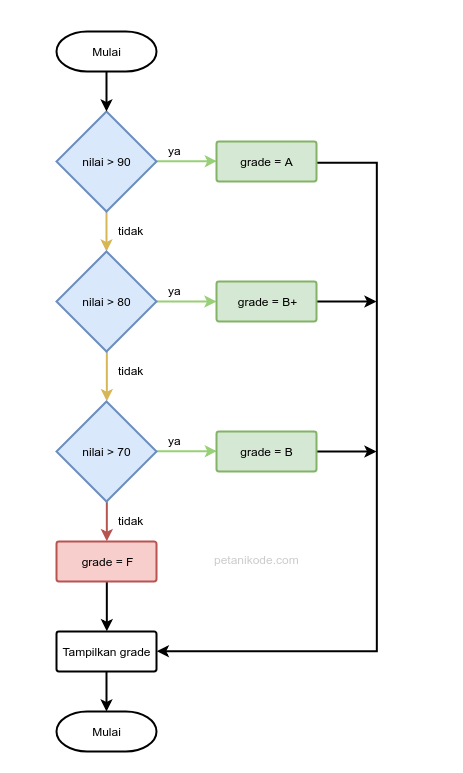

# Fungsi
- Fungsi adalah sub-program yang bisa digunakan kembali baik di dalam program itu sendiri, maupun di program yang lain.
- Contoh fungsi yang sering kita buat adalah fungsi main().
- Fungsi ini memang wajib ada di setiap program C karena akan dieksekusi pertama kali.
- Kita juga sebenarnya bisa membuat fungsi yang lain…

## Cara Membuat Fungsi pada Bahasa C
- Fungsi pada bahasa pemrograman C dapat kita buat dengan cara seperti ini:
  
- Fungsi biasanya akan mengembalikan sebuah nilai dari hasil prosesnya. Karena itu, kita harus menentukan tipe data untuk nilai yang akan dikembalikan.
- Apabila fungsi tersebut tidak memiliki nilai kembalian, maka kita harus menggunakan tipe void untuk menyatakan kalau fungsi tersebut tidak akan mengembalikan nilai apa-apa.
  ```c
  void nama_fungsi(){
    printf("Ini adalah sebuah fungsi\n");
  }
  ```
- Lalu untuk parameter bersifat opsional, nanti akan kita bahas lebih dalam.
- Sekarang mari kita coba membuat program C dengan fungsi.

### contoh
```c
#include <stdio.h>

// membuat fungsi say_hello()
void say_hello(){
    printf("Hello Selamat Datang!\n");
}

void main(){
    // memanggil fungsi say_hello()
    say_hello();
}
```

Fungsi say_hello() dapat kita panggil berulang kali pada fungsi main().

```c
#include <stdio.h>

// membuat fungsi say_hello()
void say_hello(){
    printf("Hello Selamat Datang!\n");
}

void main(){
    // memanggil fungsi say_hello()
    say_hello();
    say_hello();
    say_hello();
}
```

## Fungsi dengan Parameter
- Parameter adalah variabel yang menyimpan nilai untuk diproses di dalam fungsi.
- Parameter akan menyimpan nilai yang akan diinputkan ke dalam fungsi.
  ```c
  void say_hello(char name[]){
    printf("Hello %s!\n", name);
  }
  ```
- Pada contoh di atas, name adalah sebuah parameter berupa array dengan tipe char. Parameter ini hanya akan dikenali di dalam fungsi.
- Lalu, bagaimana cara memanggil fungsi yang memiliki parameter?
  ```c
  say_hello("Petani Kode");
  ```

- Perhatikan! "Petani Kode" adalah nilai yang akan kita berikan ke parameter.
- Biar lebih paham… mari kita coba dalam program.
- Silakan buat program baru dengan nama parameter.c, kemudian isi dengan kode berikut:

### contoh
```c
#include <stdio.h>

void say_hello(char name[]){
    printf("Hello %s!\n", name);
}

void main(){
    say_hello("Dian");
    say_hello("Petani");
    say_hello("Kode");
}
```

- Hasil outputnya akan menyesuaikan dengan nilai parameter yang kita berikan ke dalam fungsi.
- Lalu bagaimana kalau ada lebih dari satu parameter?
- Gampang…
- Tinggal ditambahkan dan dipisah dengan tanda koma seperti ini:
  ```c
  void add(int a, int b){
      printf("%d + %d = %d\n", a, b, a+b);
  }
  ```

```c
#include <stdio.h>

void add(int a, int b){
    printf("%d + %d = %d\n", a, b, a+b);
}

void main(){
    add(1, 4);
    add(8, 2);
    add(3, 2);
}
```

## Fungsi yang Mengembalikan Nilai
```c
int add(int a, int b){
    return a+b;
}
```

- Maka fungsi add() akan mengembalikan nilai berupa integer dari hasil penjumlahan nilai a dan b.

### contoh
```c
#include <stdio.h>

float bagi(int a, int b){
    float hasil = (float)a / (float)b;
    return hasil;
}

void main(){
    printf("Hasil 5/2: %.2f\n", bagi(5, 2));
}
```

## Fungsi Rekursif
- Fungsi rekursif adalah fungsi yang memanggil dirinya sendiri.
- Biasanya kita memanggil fungsi pada fungsi main atau fungsi yang lainnya. Namun, pada fungsi rekursif…
- fungsi itu akan memanggil dirinya sendiri di dalam tubuh fungsi.

### contoh
```c
#include <stdio.h>
int sum(int n);

void main(){
    int number, result;

    printf("Enter a positive integer: ");
    scanf("%d", &number);

    result = sum(number);

    printf("sum = %d", result);
}

int sum(int num){
    if (num!=0)
        return num + sum(num-1); // fungsi sum() memanggil dirinya sendiri
    else
        return num;
}
```
- Mengapa hasilnya bisa 21?
- Karena kita menginputkan nilai 6, maka akan sama dengan:
- 1 + 2 + 3 + 4 + 5 + 6 = 21

## Variabel Lokal dan Variabel Global
- Variabel lokal dan variabel global akan sering kita temukan dalam pembuatan fungsi.
- Variabel global adalah variabel yang bisa diakses dari semua fungsi. Sedangkan variabel lokal adalah variabel yang hanya bisa diakses dari dalam fungsi itu sendiri.

### contoh
```c
#include <stdio.h>

// membuat variabel global
int nilai = 9;

void main(){
    // membuat variabel lokal
    int nilai = 7;

    // mencetak variabel
    printf("Nilai: %d\n", nilai);
}
```

- Pada contoh di atas, kita membuat variabel global bernama nilai.
- Lalu di dalam fungsi main(), kita membuat variabel lagi bernama nilai dengan nilai yang berbeda.
- Variabel yang ada di dalam fungsi main() adalah variabel lokal.
- Lalu, berapakah hasil outputnya?
  - Jawabannya: 7
- Mengapa bisa 7?
  - Karena variabel nilai kita buat ulang di dalam fungsi main.
- Sekarang coba hapus variabel lokal yang ada di dalam main, sehingga akan menjadi seperti ini:

```c
#include <stdio.h>

// membuat variabel global
int nilai = 9;

void main(){
    // mencetak variabel
    printf("Nilai: %d\n", nilai);
}
```

- Maka hasil outputnya akan 9. Karena variabel yang dipakai adalah variabel global.

## Pass by Value dan Pass by Reference
- Pass by value dan pass by reference adalah cara untuk memberikan nilai pada parameter.
- Biasanya kita langsung memberikan nilai kepada parameter dengan cara seperti ini:
  ```c
  kali_dua(4);
  ```
- Ini disebut pass by value, karena di sana kita memberikan nilai 4.
- Nah kalau seperti ini:
  ```c
  kali_dua(&nama_variabel);
  ```
- Ini disebut pass by reference, karena kita memberikan alamat memori.

|    Metode   | Perubahan di Luar Fungsi |                      Alasan                      |
|:-----------:|:------------------------:|:------------------------------------------------:|
| Non-pointer | Tidak                    | Fungsi hanya memodifikasi salinan nilai.         |
| Pointer     | Ya                       | Fungsi memodifikasi nilai di alamat memori asli. |

### contoh 1
```c

#include <stdio.h>

void kali_dua(int *num){
    *num = *num * 2;
}

void main(){
    int angka = 9;

    // memanggil fungsi
    kali_dua(&angka);

    // mencetak isi variabel
    // setelah fungsi dipanggil
    printf("isi variabel angka = %d\n", angka);
}
```

- Fungsi kali_dua() memiliki parameter berupa pointer, artinya kita harus memberikan alamat memori untuk parameter ini.
- Pada saat pemanggilan, fungsi kali_dua() kita isi parameternya dengan alamat memori dari variabel angka.
- Maka hasilnya nilai variabel angka akan dikalikan dengan 2 berdasarkan rumus pada fungsi yang kita berikan.

### contoh 2
```c
#include <stdio.h>

void kali_dua(int *num) {
    *num = *num * 2; // Mengubah nilai dari alamat yang ditunjuk pointer num
}

void kali_dua_test(int num) {
    num = num * 2; // Hanya memodifikasi salinan lokal dari num
}

void main() {
    int angka = 9;

    kali_dua_test(angka);
    printf("variable angka without pointer \t= %d\n", angka);

    kali_dua(&angka);
    printf("variable angka with pointer \t= %d\n", angka);

    // Pada kali_dua_test, tidak ada perubahan pada variabel angka karena hanya salinan nilai yang dimodifikasi.
    // Pada kali_dua, variabel angka berhasil dimodifikasi karena Anda mengoper alamatnya (&angka) dan menggunakan pointer untuk mengakses nilai aslinya.
}
```

- Fungsi kali_dua_test
- Fungsi ini menerima salinan dari nilai angka. Variabel num dalam fungsi ini tidak terhubung langsung dengan variabel angka di luar fungsi.
- Ketika Anda memodifikasi num dalam fungsi ini:
  ```c
  num = num * 2;
  ```
  Perubahan ini tidak memengaruhi variabel angka asli di luar fungsi karena yang dimodifikasi hanyalah salinan.
- Akibatnya, setelah pemanggilan kali_dua_test, nilai asli dari angka tetap 9.

- Fungsi kali_dua
- Fungsi ini menerima alamat dari variabel angka (melalui pointer).
  ```c
  *num = *num * 2;
  ```
  Mengakses nilai pada alamat yang ditunjuk oleh num (nilai asli dari variabel angka) dan memodifikasinya secara langsung.
- Karena perubahan dilakukan pada lokasi memori yang sama, nilai asli dari angka di luar fungsi juga berubah menjadi 18.