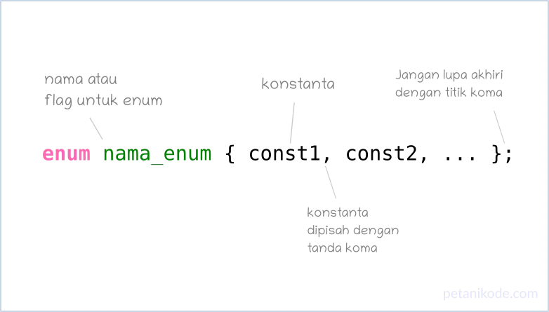

# Tipe Data Enum
## Apa itu Enum?
- Enum atau Enumeration merupakan tipe data yang berisi sekumpulan konstanta.
- Jadi, dengan Enum.. kita bisa menyimpan beberapa konstanta dalam satu variabel.
- Berikut ini cara membuat enum:
  
  ```c
  enum level {EASY = 1, NORMAL = 2, HARD = 3};
  enum sex {MALE, FEMALE};
  enum state {PENDING, INPROGRESS, DONE};
  ```
- Apabila kita tidak mengisi nilai konstanta pada enum…
- …maka secara default akan diisi dengan angka yang mengikuti urutan penulisannya.
- contoh:
  ```c
  enum hari {SENIN, SELASA, RABU, KAMIS, JUMAT, SABTU, MINGGU};
  ```
- Maka konstanta yang ada di dalam enum hari akan bernilai:
  ```c
  SENIN  = 0
  SELASA = 1
  RABU   = 2
  KAMIS  = 3
  JUMAT  = 4
  SABTU  = 5
  MINGGU = 6
  ```
- Jadi mirip-mirip seperti array ya, tapi bedanya yang di simpan dalam enum bukan variabel.. melainkan konstanta yang nilainya tak bisa kita ubah.

## Mengapa sih kita butuh Enum?
- Enum memudahkan kita menyimpan beberapa konstanta yang masih dalam satu kelompok ke dalam satu variabel. Sehingga akan membuat kode menjadi gampang dipahami.
- Misalnya, kita ingin menyimpan status pesanan.. bisa aja kita buat konstantanya satu-per-satu seperti ini.
  ```c
  const int PENDING   = 1;
  const int CANCELED  = -1;
  const int PAID      = 2;
  const int SHIPPING  = 3;
  const int DELIVERED = 4;
  ```
- Tapi kalau nanti kita sudah banyak pakai konstanta dengan nama yang sama, maka kita akan bingung membacanya.
- Karena itu, konstanta yang masih satu kelompok.. baiknya ditaruh dalam satu tempat supaya mudah.
- Sehingga kita bisa buat enum seperti ini:
  ```c
  enum OrderStatus = { PENDING, CANCELLED = -1, PAID, SHIPPING, DELIVERED };
  ```
- Lalu, kita bisa pakai dengan cara seperti ini:
  ```
  OrderStatus status = PENDING;
  ```

## Membuat Program dengan Enum
```c
#include <stdio.h>

enum hari {SENIN, SELASA, RABU, KAMIS, JUMAT, SABTU, MINGGU};

void main() {
    enum hari sekarang;
    sekarang = RABU;
    printf("Sekarang hari ke-%d", sekarang + 1);
}
```

## Membuat Tipe Data Boolean dari Enum
- Bahasa pemrograman C tidak memiliki tipe data boolean seperti bahasa pemrograman lain.
- Kita bisa membuatnya sendiri.
- Pada bahasa C, nilai true akan sama dengan 1 dan false sama dengan 0.
- Maka kita bisa membuat enum untuk boolean seperti ini:
  ```c
  enum boolean {false, true};
  ```

### contoh
```c
#include <stdio.h>

enum boolean {false, true};

void main() {
    int a = 4;
    int b = 5;

    if(a < b == true){
        printf("variabel a lebih kecil dari b\n");
    }
}
```

## Menggunakan Enum Sebagai Flags
- Flags artinya bendera, kalau dalam pemrograman.. Flags ini bisa diartikan sebagai penanda atau marker.
- Misalnya kita ingin membuat program hak akses, maka kita bisa buat flag: READ, WRITE, DELETE.
- Nantinya, data yang kita kasi flag tersebut akan bisa mengakses sesuai flag yang kita berikan.

### contoh
```c
#include <stdio.h>

int main() {
    enum Permission { READ = 1, WRITE = 2, DELETE = 4};
    int balance = 0;

    // set flags dengan operasi bitwise or
    enum Permission userPermission = READ | WRITE;

    if(userPermission & WRITE){
        printf("Anda dibolehkan mengisi saldo\n");
        balance += 100;
    }

    printf("Saldo: %i\n", balance);

    return 0;
}
```

- Pada contoh kasus ini kita mengisi nilai flag READ=1, WRITE=2, dan DELETE=4.
- Mengapa diisi begitu?
  - Ini supaya kalau diubah menjadi biner dengan operasi bitwise OR (|), binernya tidak bentrok. Ingat, operasi bitwise itu operasi yang dilakukan berdasarkan biner.
- Misalnya:
  ```c
  READ | WRITE
  ```
- Kalau dalam biner:
  ```c
  READ    = 0001;
  WRITE   = 0010;

  // maka
  READ | WRITE = 0011;
  ```

- Oke,sekarang coba ubah userPermission.
- Kita hapus flag WRITE, maka sekarang binernya akan menjadi 0001.
- Sehingga kodenya menjadi seperti ini:
- Saldonya tidak berubah, ini karena kita tidak berikan flag WRITE pada variabel userPermission.
  - Sehingga pada saat operasi userPermission & WRITE akan menghasilkan false.