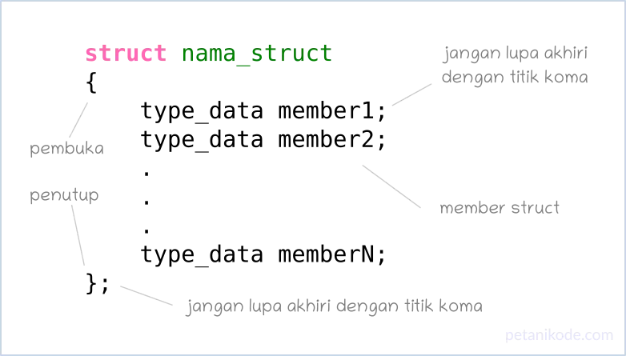

# Tipe Data Struct
- Structure atau struct adalah kumpulan dari beberapa variabel dengan beragam tipe data yang dibungkus dalam satu variabel.
- Dalam bahasa pemrograman lain, struct ini bisa disamakan seperti:
  - Records kalau di bahasa Pascal;
  - Dictionary kalau di bahasa Python;
  - Asosiatif Array kalau di bahasa PHP;
  - Object kalau di bahasa Javascript.
- Nah, untuk bahasa pemrograman C, Kita nyebutnya Struct.
- Mengapa sih kita membutuhkan struct?
- Sekarang coba perhatikan contoh kasus berikut:
- Misalnya kita ingin menyimpan data mahasiswa. Kita bisa saja melakukannya seperti ini:
  ```c
  char name[] = "Dian";
  char address[] = "Mataram";
  int age = 22;
  ```
- Lalu bagaimana kalau ada lebih dari satu mahasiswa?
  ```c
  char name[] = "Dian";
  char address[] = "Mataram";
  int age = 22;

  char name2[] = "Bambang";
  char address2[] = "Surabaya";
  int age2 = 23;

  char name3[] = "Bimo";
  char address3[] = "Jakarta";
  int age3 = 23;
  ```

- Ugh! terlihat kurang bagus.
- Biar tidak membuat banyak variabel seperti ini, maka variabel-variabel yang masih dalam satu kelompok bisa kita bungkus di dalam struct.
- Gimana caranya? Mari kita pelajari:

## Cara Membuat Struct
- Struct dapat kita buat dengan kata kunci struct kemudian diikuti dengan nama struct dan isinya.
  
  ```c
  struct Mahasiswa
  {
      char *name;
      char *address;
      int age;
  };
  ```
- Pada contoh ini, kita membuat struct dengan nama Mahasiswa.
- Perhatikan, di sini kita menggunakan tanda * (pointer) untuk tipe data char, supaya bisa diisi dengan string.
- Selain menggunakan cara di atas, kita juga bisa membuat struct dengan kata kunci typedef.
  ```c
  typedef struct Mahasiswa
  {
      char *name;
      char *address;
      int age;
  };
  ```
- atau
  ```c
  typedef struct 
  {
      char *name;
      char *address;
      int age;
  } Mahasiswa;
  ```
- Nanti kita bahas, gimana bedanya membuat struct yang menggunakan typedef dan yang tanpa `typedef.'

## Cara Menggunakan Struct
- Agar struct dapat digunakan, kita harus membuat variabel untuknya. Caranya dengan menggunakan nama struct sebagai tipe data.
  ```c
  struct Mahasiswa mhs1;
  ```
- Lalu melalui variabel mhs1, kita bisa mengakses anggota struct dengan cara seperti ini:
  ```c
  // mengisi data ke struct
  mhs1.name = "Petani Kode";
  mhs1.address = "Bandung";
  mhs1.age = 22;
  ```
- Tanda . adalah operator untuk mengakses member pada struct.
- Selain itu, kita juga bisa membuat variabel untuk struct dengan mengisinya secara langsung seperti ini:
  ```c
    struct Mahasiswa mhs1 = {
      .name = "Petani Kode",
      .address = "Bandung",
      .age = 22
  };
  ```
- Cara yang seperti ini disebut Designated initializers.
- Kita bebas menggunakan cara manapun yang diinginkan.
- Oke.. biar makin paham, mari kita coba latihan.

## Latihan Menggunakan Struct
```c
#include <stdio.h>

// membuat struct
struct Mahasiswa {
    char *name;
    char *address;
    int age;
};

int main(){

    // menggunakan struct
    struct Mahasiswa mhs1, mhs2;

    // mengisi nilai ke struct
    mhs1.name = "Dian";
    mhs1.address = "Mataram";
    mhs1.age = 22;

    // mengisi nilai ke struct
    mhs2 = {
        .name = "Bambang",
        .address = "Surabaya",
        .age = 23
    };

    // mencetak isi struct
    printf("## Mahasiswa 1 ##\n");
    printf("Nama: %s\n", mhs1.name);
    printf("Alamat: %s\n", mhs1.address);
    printf("Umur: %d\n", mhs1.age);

    printf("## Mahasiswa 2 ##\n");
    printf("Nama: %s\n", mhs2.name);
    printf("Alamat: %s\n", mhs2.address);
    printf("Umur: %d\n", mhs2.age);

    return 0;
}
```

## Gimana bedanya Struct yang pakai typedef dengan yang biasa?
- Seperti yang sudah kita pelajari di atas, struct bisa dibuat dengan dua cara. Yakni menggunakan typedef dan tanpa typedef.
- Kata kunci typedef adalah kata kunci untuk membuat tipe data baru di C. Saat kita menggunakan typedef untuk struct, maka struct tersebut akan dikenali sebagai tipe data.
- Sehingga saat menggunakan struct, kita tidak perlu lagi pakai kata kunci struct.
  ```c
  typedef struct Phone {
      char* name;
      char* cpu;
      int* memory;
  };

  struct Laptop {
      char* name;
      char* cpu;
      int memory;
  };
  ```
- Ada dua struct yang kita buat di contoh ini, yang pertama struct Phone dengan menggunakan typedef dan yang kedua struct Laptop yang tidak menggunakan typedef.
  ```c
  Phone iphone = {
      .name = "iPhone Pro max",
      .cpu = "ARM",
      .memory = 8
  }
  ```
- Sementara untuk struct Laptop harus menggunakan struct di depannya.
  ```c
  struct Laptop lenovo = {
      .name = "ThinkPad X",
      .cpu = "AMD",
      .memory = 16
  }
  ```
- Mengapa harus pakai struct di struct Laptop?
- Ya karena struct Laptop tidak pakai typedef, sehingga dia tidak dianggap sebagai tipe data.

## Struct Bersarang
- Struct bisa juga kita buat di dalam struct. Ini disebut dengan nested struct atau struct bersarang.

### contoh
```c
struct Weapon 
{
    char* name;
    int attackPower;
    int range;
};

struct Player
{
    char* name;
    int healthPoin;
    Weapon weapon;
};
```

Lalu cara menggunakannya akan seperti ini:
  
```c
Player player1;

player1.name = "Petani Kode";
player1.healthPoin = 100;
player1.weapon.name = "Katana";
player1.weapon.attackPower = 30;
player1.weapon.range = 100;
```

Atau bisa juga seperti ini:

```c
Player player1 = {
    .name = "Petani Kode",
    .healthPoin = 100, // 100%
    .weapon = {
        .name = "Katana",
        .attackPower = 30,
        .range = 100, // 1 meter
    }
};
```

### Latihan Nested Struct
```c
#include <stdio.h>

int main () {
    // mendefinisikan struct Weapon
    struct Weapon {
        char* name;
        int attackPower;
        int range;
    };

    // mendefinisikan struct Player
    struct Player {
        char* name;
        int healthPoin;
        struct Weapon weapon;
    };

    // membuat object struct
    struct Player player1 = {
        .name = "Petani Kode",
        .healthPoin = 100,
        .weapon = {
            .name = "Katana",
            .attackPower = 30,
            .range = 100
        }
    };

    // print player dan weapon
    printf("== Player Status ==\n");
    printf("Player: %s\n", player1.name);
    printf("HP: %d%\n", player1.healthPoin);
    printf("-- ⚔️ Weapon --\n");
    printf("   Name: %s\n", player1.weapon.name);
    printf("   Attack: %d\n", player1.weapon.attackPower);
    printf("   Range: %d\n", player1.weapon.range);


    return 0;
}
```

- Pada contoh ini, kita membuat dua Struct yakni struct Player dan struct Weapon. Di dalam struct Player ada struct Weapon.
- Perhatikanlah cara mengakses struct Weapon yang ada di dalam Player, kita harus mengakses player1 terlebih dahulu.. baru setelah itu kita akses weapon yang merupakan member dari Player.
  ```c
  printf("   Name: %s\n", player1.weapon.name);
  printf("   Attack: %d\n", player1.weapon.attackPower);
  printf("   Range: %d\n", player1.weapon.range);
  ```
- Kalau ada struct di dalam struct, lalu di dalam struct lagi gimana?
- Ya caranya sama aja kita harus akses dari struct terluar, lalu masuk ke dalam.
  ```c
  structLuar.struct.struct.struct;
  ```
- Tapi umumnya, nested struct dibuat sampai maksimal tiga level. Kalau lebih dari itu, akan terlihat kompleks.

### Passing Struct ke dalam Fungsi
- Struct dapat kita buat sebagai parameter untuk fungsi.

```c
#include <stdio.h>
struct student
{
    char name[50];
    int age;
};

int main() {
    struct student s1;

    printf("Enter name: ");
    scanf("%[^\n]%*c", s1.name);

    printf("Enter age: ");
    scanf("%d", &s1.age);

    display(s1);   // passing structure as an argument

    return 0;
}

// membuat fungsi dengan struct sebagai parameter
void display(struct student s) {
  printf("\nDisplaying information\n");
  printf("Name: %s", s.name);
  printf("\nRoll: %d", s.age);
}
```