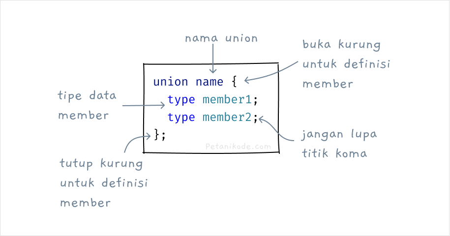
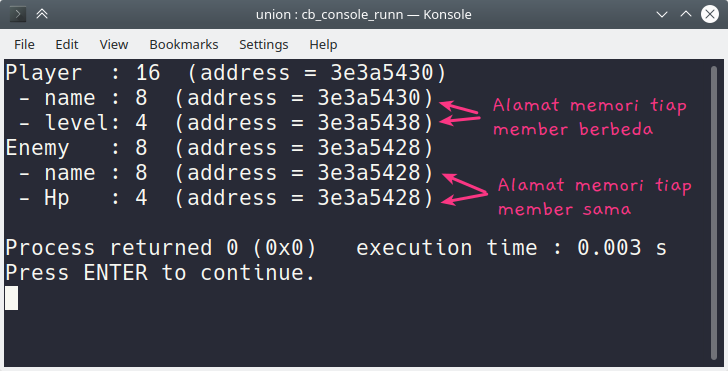

# Tipe Data Union
## Apa itu Union?
- Union adalah tipe data yang berisi sekumpulan variabel yang dibungkus jadi satu dan memiliki alamat memori yang sama.
- Tipe data ini mulai ditambahkan pada versi C11. 1
- Mengapa kita membutuhkan union?
- Untuk menjawab ini, kita akan pakai studi kasus..
- Misalnya kita akan membuat game, lalu ingin menyimpan data senjata yang dimiliki pemain.
  - Anggap saja pemain punya dua senjata, yakni: pistol dan pisau.
- Maka kita bisa membuat struct seperti ini:
  ```c
  typedef struct {
	  char *nama;
	  int jumlah_peluru;
      int ketajaman;
  } Senjata;
  ```
- Perhatikan variabel jumlah_peluru dan ketajaman. Variabel ini dibutuhkan masing-masing jenis senjata.
- Pistol membutuhkan jumlah_peluru dan pisau membutuhkan ketajaman.
- Jika pemain cuma punya pistol, berarti variabel ketajaman akan sia-sia. Begitu sebaliknya.
- Nah biar tidak sia-sia, kita harus menyimpan variabel jumlah_peluru dan ketajaman dalam satu alamat memori.
  ```c
  typedef struct {
	  char *nama;
	  union {
		  int jumlah_peluru;
		  int ketajaman;
	  }
  } Senjata;
  ```
- Dengan begini, variabel jumlah_peluru dan ketajaman akan menggunakan satu alamat memori yang sama. Ini tentunya akan lebih efisien.
- Jadi mengapa kita membutuhkan union?
- Union kita butuhkan saat kita ingin menggunakan satu alamat memori untuk dua atau lebih variabel.

## Cara Membuat Union
- Union bisa kita buat dengan kata kunci union kemudian diikuti dengan nama union-nya.
- Setelah itu kita menggunakan kurung kurawal untuk mendefinisikan member dan tipe datanya.
  
  ```c
  union Product {
    char *name;
    unsigned int price;
    unsigned int stock;
    float weight;
  };
  ```

- Lalu cara menggunakannya
  ```c
  union Product p;
  ```

- Jika menggunakan typedef, kita tidak perlu menulis union setiap kali menggunakannya.
- contoh
  ```c
  // mendefinisikan union
  typedef union {
    char *name;
    int price;
  } Product;

  //  menggunakan union
  Product p;
  ```

- Selain itu, Union juga bisa dibuat tanpa nama.
  ```c
  union {
    float x;
    float y;
  };
  ```

- Union yang tanpa nama ini bisa juga kita simpan di dalam struct.
  ```c
  struct Buku 
  {
    char *title ;
    bool is_digital;
    union 
    {
  	  char *format;
      float weight;
    };
  };
  ```

- Di dalam struct Buku terdapat union tanpa nama yang berisi variabel format dan weight. 
- Kedua variabel ini, akan menggunakan satu alamat memori yang sama dan bisa langsung diakses dari struct Buku.
  ```c
  // membuat variabel struct
  Buku belajar_c;

  // mengakses union di dalam struct
  belajar_c.format = "PDF";
  ```

## Latihan: Menggunakan Union
- Setelah tau cara mendefinisikan atau membuat union, kita saatnya kita coba menggunakannya.

### contoh
```c
#include <stdio.h>

enum notif_type {EMAIL, SMS};

typedef struct {
    char *title;
    char *message;
    enum notif_type type;
    union {
        char *phone_number;
        char *email_address;
    }
} Notification;

int main(){
    Notification sms;
    Notification email;

    sms.type = SMS;
    sms.title = "Greeting";
    sms.message = "Halo selamat datang";
    sms.phone_number = "081234567890";

    email.type = EMAIL;
    email.title = "Welcome";
    email.message = "Selamat datang di aplikasi";
    email.email_address = "mail@example.com";

    printf("## 🔔 NOTIFICATION SMS ##\n");
    printf("to: %s\n", sms.phone_number);
    printf("message: %s\n", sms.message);

    printf("## ✉ NOTIFICATION EMAIL ##\n");
    printf("subject: %s\n", email.title);
    printf("to: %s\n", email.email_address);
    printf("message: %s\n", email.message);

    return 0;
}
```

- Pada program ini, kita membuat sistem notifikasi dengan dua jenis notifikasi yang berbeda. Ada notifikasi berbentuk email dan sms.
- Berkat union kita bisa menentukan tujuan pengiriman notifikasi dengan jenis yang berbeda, yakni bisa phone_number dan email_address.

## Perbedaan Union dengan Struct
- Union sebenarnya sama seperti tipe data Struct. Namun, berbeda dalam metode alokasi memorinya.
- Struct mengalokasikan memori untuk setiap membernya pada alamat memori yang berbeda-beda.
- Sedangkan Union mengalokasikan memori di satu alamat memori dengan ukuran diambil dari ukuran member yang paling besar.
  ```c
  struct Player {
    char *name; // address: aabbccdd
    unsigned int level; // address: aaffeedd
  }

  union Enemy {
    char *name; // 11ffdd22
    unsigned int hp; // 11ffdd22
  }
  ```

- Setiap member pada struct Player akan menggunakan alamat memori yang berbeda. Sedangkan union Enemy hanya menggunakan satu alamat memori saja.

### Latihan: Struct vs UnionLatihan: Struct vs Union
```c
#include <stdio.h>

int main(){

    struct Player {
        char *name;
        unsigned int level;
    };

    union Enemy {
        char *name;
        unsigned int hp;
    };

    struct Player player1;
    player1.name = "Petani Kode";
    player1.level = 1;

    printf("Player  : %d  (address = %x)\n", sizeof(player1), &player1);
    printf(" - name : %d  (address = %x)\n", sizeof(player1.name), &player1.name);
    printf(" - level: %d  (address = %x)\n", sizeof(player1.level), &player1.level);


    union Enemy zombie;
    zombie.name = "Zombie 1";
    zombie.hp = 100;

    printf("Enemy   : %d  (address = %x)\n", sizeof(zombie), &zombie);
    printf(" - name : %d  (address = %x)\n", sizeof(zombie.name), &zombie.name);
    printf(" - Hp   : %d  (address = %x)\n", sizeof(zombie.hp), &zombie.hp);

    return 0;
}
```



- Ukuran memori union Enemy adalah 8 karena mengambil dari ukuran member yang paling besar, yakni ukuran dari name.
- Alamat memori yang digunakan tiap member pada union adalah sama. Tidak seperti struct Player yang alamatnya berbeda-beda.