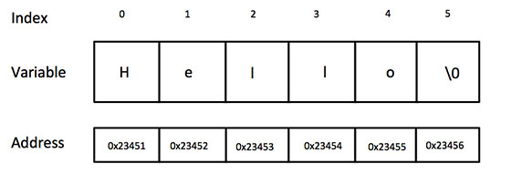
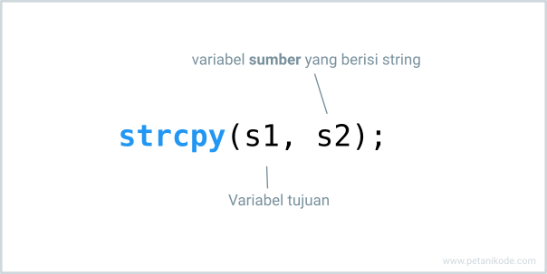
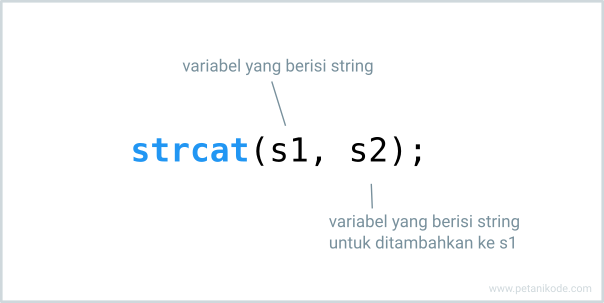
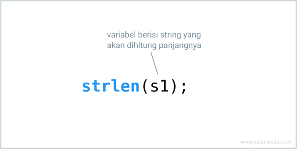
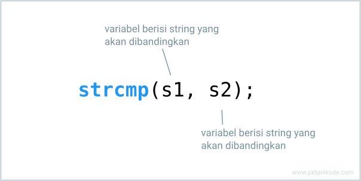
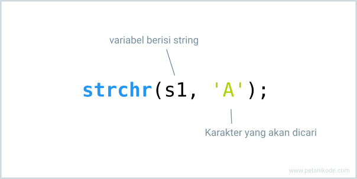
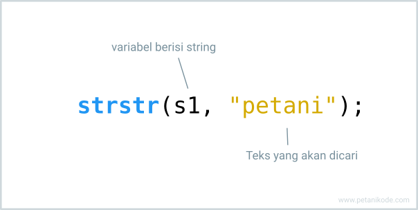

# Tipe Data String
## Apa itu String?
- String pada adalah sebuah array satu dimensi yang berisi kumpulan dari huruf atau karakter dan diakhiri dengan karakter kosong \0 (null). 1
- Bahasa pemrograman C memang tidak memiliki tipe data string, tapi kita tetap bisa membuat string dengan tipe data char.
  ```c
  char greeting[6] = {'H', 'e', 'l', 'l', 'o', '\0'};
  ```
  
- Contoh ini bisa juga kita tulis seperti ini:
  ```c
  char greeting[] = "Hello";
  ```
- Ngomong-ngomgong…
- Mengapa String di C harus diakhiri dengan karakter kosong \0?
- Ingat kembali sejarah dan asal usul bahasa C:
- Dimulai dari bahasa assembly, kemudian BCPL atau B, lalu jadilah bahasa C.
- Karena itu, C masih mengadopsi desain atau rancangan dari bahasa sebelumnya yang mengharuskan string untuk diakhiri dengan karakter kosong.
- Selain itu, ini juga akan memudahkan dalam menghitung panjang string dan alokasi memori untuk string. 2
- Karena saat itu memori komputer sangat terbatas.
- Jadi, meskipun kita membuat string seperti ini:
  - Dia akan tetap ditambahkan karakter \0 di belakangnya.

# Fungsi-fungsi untuk Manipulasi String
## Fungsi strcpy()
- Fungsi strcpy() digunakan untuk meng-copy string dari sebuah variabel ke variabel yang lainnya.
  

### contoh
```c
#include <stdio.h>

void main(){

    char title[] = "Belajar Bahasa C";
    char title_copy[20];

    // copy string title ke title_copy
    strcpy(title_copy, title);

    // maka sekarang title_copy akan berisi:
    printf("isi title_copy: %s\n", title_copy);

}
```

## Fungsi strcat()
- Fungsi strcat() digunakan untuk menambahkan string dari belakang.
  

### contoh
```c
#include <stdio.h>

void main(){

    char nama[] = "Ahmad Muhardian";
    char gelar[] = ", S.Kom";

    // Menggabungkan string
    strcat(nama, gelar);

    printf("Nama lengkap: %s\n", nama);

}
```

## Fungsi strlen()
- Fungsi strlen() digunakan untuk menghitung panjang string.
  

### contoh
```c
#include <stdio.h>

void main(){

    char nama[] = "Ahmad Muhardian";
    int panjang_nama;

    // menghitung panjang nama
    panjang_nama = strlen(nama);

    printf("Nama: %s\n", nama);
    printf("Panajang: %d karakter\n", panjang_nama);

}
```

## Fungsi strcmp()
- Fungsi strcmp() digunakan untuk membandingkan string dengan string yang lainnya.
  
- Fungsi strcamp() akan menghasilkan nilai 0 apabila kedua string yang dibandingkan sama. Tapi kalau berbeda akan menghasilkan angka yang berbeda-beda.

### contoh
```c
#include <stdio.h>

void main(){

    char str1[] = "Petani";
    char str2[] = "Kode";
    int hasil;

    // membandingkan string
    hasil = strcmp(str1, str2);

    if(hasil == 0){
        printf("str1 dan str2 sama");
    } else {
        printf("str1 dan str2 berbeda");
    }
}
```

## Fungsi strchr()
- Fungsi strchr() digunakan untuk mencari sebuah karakter di dalam string.
  

### contoh
```c
#include <stdio.h>

void main(){

    char nama[] = "Petani Kode";
    char huruf = 'e';
    char* hasil;

    printf("Mencari huruf '%c' dalam nama...\n", huruf);
    // mencari huruf
    hasil = strchr(nama, huruf);

    while(hasil != NULL){
        printf("Ditemukan pada huruf ke-%d\n", hasil - nama+1);
        hasil = strchr(hasil+1, huruf);
    }
}
```

## Fungsi strstr()
- Fungsi strstr() digunakan untuk mencari sebuah teks (string) di dalam string.
  
- Biasanya fungsi ini dipadukan dengan fungsi strncpy() untuk mencari dan mengubah isi teks.


### contoh
```c
#include <stdio.h>

void main(){
    char str[] ="Petani code!";
    char * hasil;

    // cari kata "code"
    hasil = strstr(str,"code");

    // lalu ubah kata "code" menjadi "kode"
    strncpy (hasil, "kode", 4);

    puts(str);
}
```