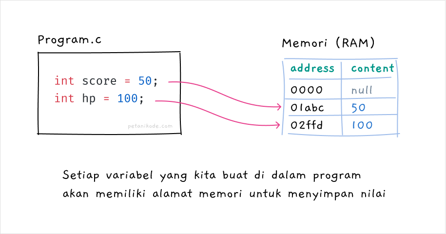
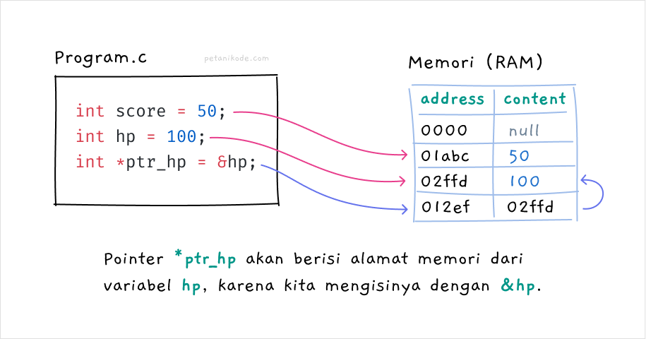
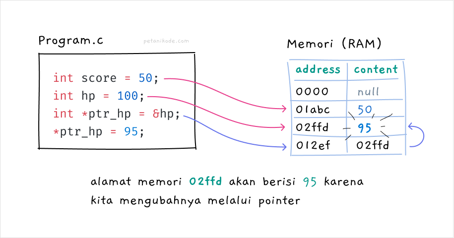

# Pointer
## Apa itu Pointer?
- Setiap variabel yang kita buat pada program akan memiliki alamat memori.
- Alamat memori berfungsi untuk menentukan lokasi penyimpanan data pada memori (RAM).
- Kadang alamat memori ini disebut reference atau referensi.
- Coba perhatikan gambar ini:
  
- Pada gambar ini, kita membuat dua variabel.. yakni score dan hp.
- Kedua variabel ini punya alamat memori masing-masing.
  - Variabel score alamat memorinya adalah 01abc, sedangkan hp alamat memorinya 02ffd.
- Selama sebuah alamat masih kosong.. maka alamat itu yang akan dipilih.
- Oya, pemilihan alamat memori ini, dilakukan secara acak. Inilah mengapa memori ini di sebut RAM (Random Access Memory).
  - Intinya, setiap kita membuat variabel pasti akan punya alamat memori.
- Kalau tidak percaya, kamu bisa buktikan sendiri dengan menggunakan simbol & (ampersand).

### contoh
```c
#include <stdio.h>

void main () {

   int  a;
   char b[10];

   printf("Alamat memori variabel a: %x\n", &a);
   printf("Alamat memori variabel b: %x\n", &b);

}
```

- Pada program ini, kita menggunakan simbol & untuk mengambil alamat memori dari variabel a dan b.
- Lalu menggunakan format specifier %x untuk menampilkannya dalam bilangan heksadesimal.

- Lalu apa hubungannya alamat memori dengan pointer?
- Mari kita bahas…
  - Pointer adalah sebuah variabel khusus yang berisi alamat memori. Pointer nantinya akan bisa mengakses data yang ada di suatu alamat memori.1
- Kata kunci yang perlu kamu ingat:
  - “Pointer berisi alamat memori”

## Cara Membuat Pointer
- Pointer dibuat dengan menambahkan simbol * (asterik) di depan namanya, kemudian diisi dengan alamat memori yang akan digunakan sebagai referensi.
  ```c
  int *pointer1 = 00001;
  ```
- Maka *pointer1 akan bisa mengakses data yang ada pada alamat memori 00001. Dengan kata lain, si *pointer1 akan menggunakan alamat 00001 sebagai referensinya.
- Kita juga bisa membuat pointer tanpa harus mengisinya langsung dengan alamat memori.
  ```c
  int *pointer_ku;

  // atau bisa juga
  int *pointer_ku = NULL;
  ```
- Maka *pointer_ku akan menggunakan alamat memori 00000, alamat memori ini khusus untuk menyimpan data null atau data kosong.
- Sekarang masalahnya:
  - Karena kita tidak bisa lihat daftar alamat memori secara langsung, kita akan kesulitan memberikan referensi alamat memori untuk pointer.
- Belum lagi.. beda komputer beda juga alamat memorinya. Ada yang 8 bit, ada juga yang 16, 32, dan sebagainya.
- Solusinya:
  - Kita harus mengambil alamat memori dari variabel yang lain.
- Masih ingat caranya?
  - Ya, dengan menggunakan simbol &.



- Pada gambar ini, kita membuat pointer dengan nama *ptr_hp* dengan isi alamat memori dari variabel hp.
- Dengan begini..
  - Pointer *ptr_hp akan bisa mengakses nilai pada alamat memori 02ffd yang mana ini adalah alamat memori dari variabel hp.
- Jika kita ingin mengubah nilai pada alamat memori tersebut, maka kita bisa gunakan pointer *ptr_hp seperti ini:
  ```c
  *ptr_hp = 95;
  ```
- Maka, sekarang alamat memori 02ffd akan berisi 95 begitu juga dengan variabel hp.
  

## Latihan: Mengakses data dengan Pointer
```c
#include <stdio.h>

void main(){
    int score = 50;
    int hp = 100;

    // membuat pointer dengan isi alamat memori dari hp
    int *ptr_hp = &hp;

    // print isi variabel dan alama memori
    printf("Nama Variabel \t Alamat \t Konten\n");
    printf("score \t\t %x \t %d \n", &score, score);
    printf("hp \t\t %x \t %d \n", &hp, hp);
    printf("ptr_hp \t %x \t %x \n", &ptr_hp, ptr_hp);
    printf("*ptr_hp \t %x \t %d \n", &ptr_hp, *ptr_hp);

    // mengubah data pada alamat memori dengan pointer
    *ptr_hp = 95;

    printf("hp \t\t %x \t %d \n", &hp, hp);
    printf("*ptr_hp \t %x \t %d \n", &ptr_hp, *ptr_hp);
}
```

- Pointer *ptr_hp berhasil mengubah nilai pada alamat d57ba6c menjadi 95.
- Saat menggunakan pointer, kita menggunakan tanda * di depan nama pointer untuk mengakses nilai pada alamat memori. Jika tidak menggunakan tanda ini, maka kita akan mendapatkan alamat memori yang di-pointing.
  ```c
  *ptr // ini akan berisi 95 (nilai dari alamat)
  ptr // ini akan berisi d57ba6c (alamat memori dari variabel hp)
  ```
- Oh iya, pointer juga punya alamat memorinya sendiri.
- Pada contoh di atas, alamat memori dari pointer *ptr_hp adalah d57ba70. Mungkin di komputermu akan berbeda, silakan di cek sendiri.
  
- Alamat memori yang dipakai *ptr_hp adalah 012ef dengan isi alamat memori 02ffd.
- Sapai di sini sudah paham?
- Sekarang pertanyaannya:
- Kalau kita menggunakan pointer, bukankah ini akan boros memori? Karena kita harus mengalokasikan alamat memori untuk si pointernya juga.
- Jika kita bisa menggunakan variabel biasa, ngapain pakai pointer?
- Penggunaan pointer sebenarnya opsional, kamu boleh pakai.. boleh juga tidak.
- Namun.. Pada kondisi tertentu, penggunaan pointer lebih optimal.

## Kapan Saya Harus Pakai Pointer?
- Seperti yang saya katakan tadi, kita tidak harus selalu menggunakan pointer dalam program.
- Namun, ada beberapa kasus tertentu yang menyarankan menggunakan pointer daripada cara biasa.
- Biar jelas..
  - Kita bahas dulu, mengapa pointer diciptakan?
- Jadi zaman dulu, memori komputer itu sangat terbatas. Tidak seperti sekarang yang kapasitasnya sampai giga-gigaan.
- Saat kita melakukan operasi iterasi pada tipe data seperti array, string, tree, linked list, graph, dan sebagainya.. sering kali memakan banyak memori dan membuat programnya lambat.
- Penggunaan Pointer pada operasi semacam akan meningkatkan performa secara signifikan dibandingkan tanpa menggunakan pointer. 1

## Latihan: Pointer untuk Pass by Reference pada Fungsi
- Pertama kita akan coba menggunakan pointer untuk melakukan passing argumen berdasarkan referensinya (pass by reference).

### contoh
```c
#include <stdio.h>

void add_score(int score){
    score = score + 5;
}

void main(){
    int score = 0;

    printf("score sebelum diubah: %d\n", score);
    add_score(score);
    printf("score setelah diubah: %d\n", score);
}
```

- Pada program ini, kita membuat fungsi dengan nama add_score() untuk menambahkan nilai score sebanyak 5.
- Nilai variabel score tidak berubah, ia tetap bernilai 0.
- Mengapa?
  - Ini karena kita melakukan pass by value, bukan pass by reference.
  - Variabel score kan dibuat di dalam fungsi main(), lalu ketika fungsi add_score() mencoba mengubah nilainya..
- …maka perubahan hanya terjadi secara lokal di dalam fungsi add_score() saja.
- Nggak percaya?
- Coba buktikan dengan mengubah fungsi add_score() menjadi seperti ini:

```c
#include <stdio.h>

void add_score(int score){
    score = score + 5;
    printf("Score diubah ke %d\n", score);
}

void main(){
    int score = 0;

    printf("score sebelum diubah: %d\n", score);
    add_score(score);
    printf("score setelah diubah: %d\n", score);
}
```

- Benar kan yang saya katakan..
- Nilai score pada fungsi add_score() sudah berubah menjadi 5, namun variabel score pada fungsi main() akan tetap bernilai 0.
- Nah.. Di sinilah kita harus menggunakan pointer untuk melakukan pass-by-reference.
- Sekarang, coba ubah kode programnya menjadi seperti ini:

```c
#include <stdio.h>

void add_score(int *score){
    *score = *score + 5;
    printf("score diubah ke: %d\n", *score);
}

void main(){
    int score = 0;

    printf("score sebelum diubah: %d\n", score);
    add_score(&score);
    printf("score setelah diubah: %d\n", score);
}
```

- Karena argumen fungsi add_score() kita ubah menjadi pointer, maka kita harus memberikan alamat memori saat memanggilnya.
- Setiap fungsi add_score() dipanggil atau dieksekusi, maka nilai variabel score akan bertambah 5.

```c
#include <stdio.h>

void add_score(int *score){
    *score = *score + 5;
    printf("score diubah ke: %d\n", *score);
}

void main(){
    int score = 0;

    printf("score sebelum diubah: %d\n", score);
    add_score(&score);
    add_score(&score);
    add_score(&score);
    add_score(&score);
    add_score(&score);
    add_score(&score);
    printf("score setelah diubah: %d\n", score);
}
```

## Latihan: Pointer untuk Mengakses Data pada Array
- Pointer juga sering digunakan untuk mengakses data pada array.

### contoh
```c
#include <stdio.h>

void main(){
    printf("## Program Antrian CS ##\n");

    char no_antrian[5] = {'A', 'B', 'C', 'D', 'E'};

    // menggunakan pointer
    char *ptr_current = &no_antrian;

    for(int i = 0; i < 5; i++){
        printf("📢 Pelanggan dengan no antrian %c silakan ke loket!\n", *ptr_current);
        printf("Saat ini CS sedang melayani: %c\n", *ptr_current);
        printf("-------- Tekan Enter untuk Next --------");
        getchar();
        ptr_current++;
    }

    printf("✅ Selesai");
}
```

- Pada program ini, kita menggunakan ptr_current untuk mengakses elemen array. Saat pertama kali dibuat, pointer ptr_current akan mereferensi pada elemen pertama array.
- Lalu pada perulangan dilakukan increment ptr_current++, maka pointer ini akan mereferensi ke elemen array selanjutnya.

## Latihan: Pointer untuk Mengakses Data pada Struct
- Menggunakan pointer pada struct akan membantu kita membuat kode menjadi lebih mudah dan gampang dibaca dibandingkan tanpa pointer.
- Misalnya kita punya struct seperti ini:
  ```c
  struct Player {
    char *name;
    int score;
    int hp;
  	struct Weapon *weapon;
  };

  struct Weapon {
  	char *name;
    int attack;
    int guard;
  };
  ```

- Struct Player di dalamnya ada struct lagi, yakni struct Weapon. Nah di sini kita menggunakan pointer untuk struct Weapon.
  ```c
  struct Weapon *weapon;
  ```
- Gimana cara mengakses data di struct weapon?
- Ada dua cara, kita bisa pakai operator . (dot/titik) dan -> (operator pointer).
- Pertama kita coba dulu pakai titik.

### contoh 1
```c
#include <stdio.h>

void main(){
    struct Player {
        char *name;
        int score;
        int hp;
        struct Weapon *weapon;
    };

    struct Weapon {
        char *name;
        int attack;
        int guard;
    };

    struct Player player1;
    player1.name    = "Petani Kode";
    player1.score   = 0;
    player1.hp      = 100;

    (*player1.weapon).name = "Katana";
    (*player1.weapon).attack = 16;
    (*player1.weapon).guard = 10;

    // cetak status player
    printf("PLAYER STATUS\n");
    printf("Name: %s\n", player1.name);
    printf("Score: %d\n", player1.score);
    printf("HP: %d\n", player1.hp);
    printf("Weapon\n");
    printf("  name: %s\n", (*player1.weapon).name);
    printf("  attack: %d\n", (*player1.weapon).attack);
    printf("  guard: %d\n", (*player1.weapon).guard);
}
```

- Saat kita mengakses data member pada struct yang bentuknya pointer dengan operator dot atau titik, maka kita harus menggunakan tanda kurung dan * untuk menyatakan itu adalah pointer.
  ```c
  (*player1.weapon).name = "Katana";
  (*player1.weapon).attack = 16;
  (*player1.weapon).guard = 10;
  ```
- Jika hanya satu member yang berbentuk pointer struct, ini oke-oke aja.
- Tapi.. Kalau misalnya ada member struct pointer dan di dalamnya lagi ada struct pointer dan di dalamnya ada struct pointer, pasti kita akan bingung.
- Bisa saja kodenya seperti ini:
  ```c
  (*(*(*player.weapon).katana).type).name = "Wakizashi";
  ```
- Duh! saya aja bingung bacanya.
  - Nah, biar gak seperti ini.. maka sebaiknya pakai Pointer. Sehingga akan bisa seperti ini:

```c
player->weapon->katana->type->name = "Wakizashi";
```

- Ini lebih mudah dibaca dibandingkan yang tadi.
- Jadi, jika ada member pointer di dalam Struct, maka sebaiknya pakai operator -> untuk mengakses membernya.

### contoh
```c
#include <stdio.h>

void main(){
    struct Player {
        char *name;
        int score;
        int hp;
        struct Weapon *weapon;
    };

    struct Weapon {
        char *name;
        int attack;
        int guard;
    };

    // membuat struct player
    struct Player player;
    // membuat pointer untuk player
    struct Player *player1;
    player1 = &player;

    player1->name    = "Petani Kode";
    player1->score   = 0;
    player1->hp      = 100;

    player1->weapon->name = "Katana";
    player1->weapon->attack = 16;
    player1->weapon->guard = 10;

    // cetak status player
    printf("PLAYER STATUS\n");
    printf("Name: %s\n", player1->name);
    printf("Score: %d\n", player1->score);
    printf("HP: %d\n", player1->hp);
    printf("Weapon\n");
    printf("  name: %s\n", player1->weapon->name);
    printf("  attack: %d\n", player1->weapon->attack);
    printf("  guard: %d\n", player1->weapon->guard);
}
```

- Pada program ini kita membuat dua variabel untuk struct Player, yakni player dan player1. Variabel player1 akan menjadi pointer untuk mengakses data pada player.
  ```c
  // membuat struct player
  struct Player player;
  // membuat pointer untuk player
  struct Player *player1;
  player1 = &player;
  ```

- Selain cara ini, kita juga bisa pakai fungsi malloc() seperti ini:
  ```c
  // alokasi memori untuk player1
  struct Player *player1 = (struct Player*) malloc(sizeof(struct Player));
  // alokasi memori untuk player->weapon
  player1->weapon = (struct Weapon*) malloc(sizeof(struct Weapon));
  ```