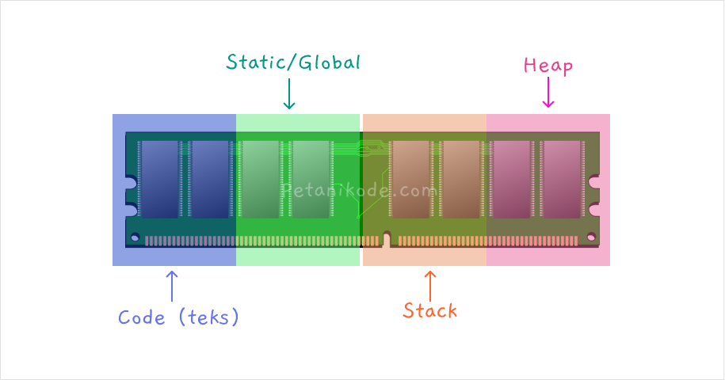
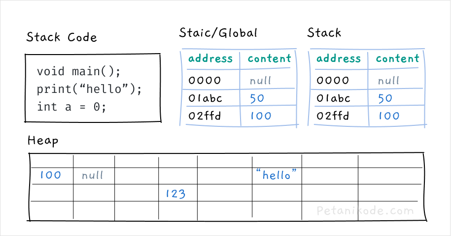

# Alokasi Memori Secara Dinamis
- Mengapa Kita Membutuhkan Malloc()?
- Saat kita menjalankan program, komputer akan mengalokasikan memori (RAM) menjadi empat bagian:
  - Bagaian untuk menyimpan kode (Stack Code);
  - Bagian untuk menyimpan variabel global atau static seperti konstanta;
  - Bagian untuk menyimpan variabel lokal, area ini bisa kita sebut stack;
  - Bagian untuk menyimpan variabel dengan alokasi dinamis (heap).



- Bagian Code akan menyimpan kode instruksi dari program. Kemudian bagian Global, Stack, dan Heap akan menyimpan nilai dari variabel.
- Kira-kira isinya mungkin akan seperti ini:
  
  ```c
  #include <stdio.h>

  int score = 0;

  void main() {
     int level = 1;
  }
  ```
- Maka semua baris instruksi akan disimpan ke dalam Stack Code. Nilai dari variabel score akan disimpan pada bagian stack Static/Global dan nilai dari variabel level akan disimpan di dalam Stack.
  - Isi Stack Code:
  
| Address | Content            |
|---------|--------------------|
| 0000    | #include <stdio.h> |
| 0001    | int score = 0      |
| 0002    | void main();       |
| 0003    | int level = 1      |

- Isi Stack Global:

| Address | Content       |
|---------|---------------|
| 0000    | null          |
| 000a    | 0             |

- Anggap saja 000a adalah alamat memori dari variabel score.
  - Isi Stack Lokal:

| Address | Content       |
|---------|---------------|
| 0000    | null          |
| 000b    | 1             |

- Anggap saja 000b adalah alamat memori dari variabel level.
- Sementara area Heap dipakai untuk menyimpan data yang ukurannya dinamis dan akan disimpan di lokasi yang acak.
- Contoh data dinamis kayak gimana?
- Data yang ukurannya tidak tetap.

```c
// ini variabel dengan ukuran tetap
int enemies[10];

// ini ukuran variabel dengan ukuran dinamis
char name[];
```

- Variabel enemies akan berukuran 10 * 4 byte, yakni 400 byte. Ini karena tipe data integer ukuran default-nya adalah 4 byte. Saat kita membuat array dengan isi 10 integer, maka ukurannya akan 10 kali lipat.
- Artinya, variabel enemies sudah kita alokasikan ukurannya 10 * 4 byte dan ini tidak bisa berubah secara dinamis.
- Misalnya, kita ingin isi variabel enemies dengan 15 item, maka ini tidak akan bisa.. karena ukurannya sudah dibatasi 10.
- Sementara untuk variabel name, bisa kita isi dengan panjang berapapun karena ukurannya dinamis.

- Membuat variabel seperti ini:
  ```c
  char name[];
  ```

- Akan membuatnya disimpan ke dalam Stack, bukan Heap.
- Memangnya kenapa kalau disimpan di dalam Stack?
- Stack punya batasan yang sudah ditentukan oleh sistem operasi.
- Misalnya, anggap saja ukuran stack kita 100 MB. Lalu kita mengisi variabel name dengan teks yang ukurannya 500 MB.
- Maka apa yang akan terjadi?
  - “Stack Overflow”
- Yap, nama StackOverflow diambil dari istilah ini.
- Eh, kok malah bahas StackOverflow. 😄
- Masalah Stack Overflow adalah masalah saat kita memberikan data yang melebihi ukuran stack pada memori.
- Biar tidak terjadi Stack Overflow, maka kita harus pakai memori Heap.
- Gimana Caranya? Caranya menggunakan fungsi untuk alokasi memori seperti malloc(), calloc(), realloc(), dan free().

## Mengenal Fungsi malloc()
- Fungsi malloc() merupakan fungsi untuk mengalokasikan memori secara dinamis dan datanya akan disimpan pada memori heap.
- Fungsi ini berada di dalam library stdlib.h, jadi jika ingin pakai fungsi malloc() maka library stdlib.h harus kita import terlebih dahulu dengan #include.
  ```c
  #include <stdlib.h>
  ```
- Barulah setelah itu kita bisa pakai fungsi malloc().
- Cara menggunakannya gimana?
- Fungsi malloc() menghasilkan sebuah pointer. Pointer tersebut berisi alamat memori pada heap.
- Berikut ini format penggunaan malloc():
  ```c
  type *nama_var = malloc(ukuran);
  ```
- Penjelasan:
  - type adalah tipe data variabel yang ingin kita buat;
  - *nama_var adalah variabel yang bentuknya pointer;
  - ukuran adalah ukuran alokasi memori dalam satuan byte dengan tipe integer.

- Contoh:
  ```c
  int *score = malloc(32);
  ```

- Pada contoh ini, kita membuat variabel *score dengan tipe data int dan akan disimpan ke dalam heap dengan ukuran 32 byte.
- Jika ingin ukurannya mengikuti ukuran tipe data, kita bisa gunakan fungsi sizeof() seperti ini:
  ```c
  int *score = malloc(sizeof(int));
  ```
- Artinya ukuran variabel *score di Heap akan mengikuti ukuran tipe data int, yakni 4 byte.
- Fungsi sizeof() biasanya kita pakai untuk menentukan ukuran secara dinamis.
- Misalnya kita meminta user untuk menginputkan namanya dan kita bisa mengalokasikan ukuran memori berdasarkan panjang namanya dengan fungsi sizeof(name).
  ```c
  char name[] = "Petani Kode"; // diinputkan user

  // alokasi memori dinamis
  char *name = malloc(sizeof(name));
  ```

### Latihan: Fungsi malloc()
```c
#include <stdio.h>
#include <stdlib.h>

void main(){
    struct Player {
        char *name;
        unsigned int hp;
        unsigned int xp;
        unsigned int level;
    };

    // menggunakan malloc
    struct Player *player1 = malloc(sizeof(struct Player));

    player1->name = "Petani Kode";
    player1->hp = 100;
    player1->xp = 5;
    player1->level = 1;

    printf(":: PLAYER STATUS ::\n");
    printf("name : %s\n", player1->name);
    printf("hp   : %d\n", player1->hp);
    printf("xp   : %d\n", player1->xp);
    printf("level: %d\n", player1->level);
}
```

Pada contoh ini, kita menggunakan fungsi malloc() untuk mengalokasikan memori pada variabel *player. Ukuran alokasi memorinya akan mengikuti ukuran dari struct Player, karena kita menggunakan fungsi sizeof() di sana.

## Mengenal Fungsi calloc()
- 