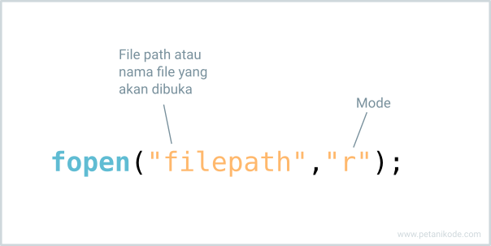
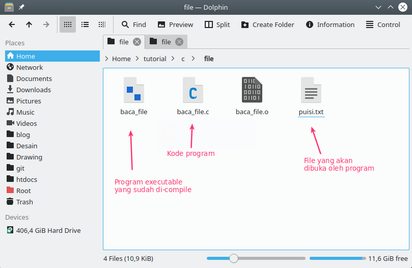
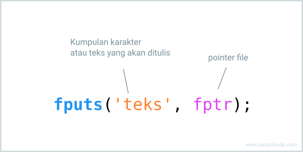

# Membaca dan Menulis File
- Memanfaatkan variabel saja tidak akan cukup untuk menyimpan data. Karena itu, kita membutuhkan media penyimpanan lain seperti File.
- Dengan demikian, kita akan tetap memiliki data, meskipun programnya sudah ditutup.
- Filenya juga bisa kita kirim ke komputer lain dan dibuka dari sana.

## Membaca File
- Sebelum kita mulai, saya ingin kasih tahu:
  - “File di komputer itu ada dua jenis, yakni file teks dan binary.”

- **File teks** biasanya dibuat dengan teks editor, contohnya seperti: file txt, file csv, file html, dll.
  - File teks mudah dibaca dan ditulis.

- Sedangkan **file binary** adalah file yang tersimpan dalam bentuk biner (0 & 1). Contohnya seperti: File exe dan file bin.
  - File binary sulit dibaca, namun dapat menyimpan data lebih banyak dan aman.

---
- Berikut ini adalah fungsi untuk membuka atau membaca file di C:
  
- Fungsi fopen() akan membuka file sesuai dengan mode yang kita berikan.
- Mode r artinya read atau baca saja. Selain mode r ada juga mode yang lain.
- Berikut ini daftar lengkap modenya:

| Mode | Arti                                                  | Jika File Tidak ada                 |
|------|-------------------------------------------------------|-------------------------------------|
| r    | Buka untuk dibaca                                     | return NULL.                        |
| rb   | Buka untuk dibaca dalam binary.                       | return NULL.                        |
| w    | Buka untuk ditulis                                    | Buat baru atau tulis ulang jika ada |
| wb   | Buka untuk ditulis dalam binary                       | Buat baru atau tulis ulang jika ada |
| a    | Buka untuk ditambahkan                                | Buat baru atau tulis ulang jika ada |
| ab   | Buka untuk ditambahkan dalam binary                   | Buat baru atau tulis ulang jika ada |
| r+   | Buka untuk dibaca dan ditulis                         | returns NULL.                       |
| rb+  | Buka untuk dibaca dan ditulis dalam binary            | returns NULL.                       |
| w+   | Buka untuk ditulis dan dibaca                         | Buat baru atau tulis ulang jika ada |
| wb+  | Buka untuk dibaca dan ditulis dalam binary            | Buat baru atau tulis ulang jika ada |
| a+   | Buka untuk dibaca dan ditambahkan isinya              | Buat baru atau tulis ulang jika ada |
| ab+  | Buka untuk dibaca dan ditambahkan isinya dalam binary | Buat baru atau tulis ulang jika ada |

- Fungsi fopen() akan menghasilkan sebuah pointer yang menunjuk ke alamat memori dari file yang akan dibuka, karena itulah kita membutuhkan pointer untuk mengaksesnya.
  ```c
  // membuat pointer
  File *fptr;

  // membuka file
  fptr = fopen("namafile.txt", "r");
  ```
- Oke sekarang mari kita coba untuk membaca file saja..

### contoh
```c
#include <stdio.h>

void main()
{
  char buff[255];
  FILE *fptr;

  // membuka file
  if ((fptr = fopen("puisi.txt","r")) == NULL){
      printf("Error: File tidak ada!");
      // Tutup program karena file gak ada.
      exit(1);
  }

  // baca isi file dengan gets lalu simpan ke buff
  fgets(buff, 255, fptr);
  // tampilkan isi file
  printf("%s", buff);

  // tutup file
  fclose(fptr);
}
```

- Hasilnya akan error, karena program tidak menemukan file yang akan dibuka.
- Nah sekarang coba buat file puisi.txt dengan isi sebagai berikut:
  ```
  Ini adalah puisi untuk kamu
  tapi isinya gak jelas

  Ah yang penting file ini
  ada isinya.

  Cuma buat ngetes aja sih.
  ```
- Simpan file ini satu direktori dengan programnya.
  

- Isi file akan dibaca satu baris karena kita menggunakan fungsi fgets().
  ```c
  fgets(buff, 255, fptr);
  ```

- Fungsi fgets() akan membaca isi file yang ditunjuk oleh pointer fptr, kemudian hasilnya akan disimpan ke dalam variabel buff.
- Fungsi fgets() hanya akan membaca satu baris saja. Anka 255 adalah panjang baris (karakter) yang akan dibaca.
  ```c
  fgets(buff, 20, fptr);
  ```
- Panjang karakter ini, bisa juga kita ambil dengan fungsi sizeof() agar mengikuti panjang karakter dari variabelnya.
  ```c
  sizeof(buff);
  ```
- Lalu bagaimana cara membaca semua baris teks yang ada di dalam file?
- Kita tinggal panggil fungsi fgets() berkali-kali.

### contoh 2
```c
#include <stdio.h>

void main()
{
    char buff[255];
    FILE *fptr;

    // membuka file
    if ((fptr = fopen("puisi.txt","r")) == NULL){
        printf("Error: File tidak ada!");
        // Tutup program karena file gak ada.
        exit(1);
    }

    // baca isi file dengan gets lalu simpan ke buff
    fgets(buff, sizeof(buff), fptr);
    printf("%s", buff);
    fgets(buff, sizeof(buff), fptr);
    printf("%s", buff);
    fgets(buff, sizeof(buff), fptr);
    printf("%s", buff);
    fgets(buff, sizeof(buff), fptr);
    printf("%s", buff);

    // tutup file
    fclose(fptr);
}
```

- Program akan membaca empat baris dari isi file, ini karena kita memanggil fungsi fgets() sebanyak empat kali.
- Tapi masalahnya nanti:
- “Gimana kalau isi filenya ada banyak, misal 1000 baris?”
- “Kita gak mungkin kan harus mengetik perintah itu berulang-ulang”
  - Benar sekali…
- Ini bisa kita atasi dengan perulangan. Contohnya seperti ini:

```c
#include <stdio.h>

void main()
{
    char buff[255];
    FILE *fptr;

    // membuka file
    if ((fptr = fopen("puisi.txt","r")) == NULL){
        printf("Error: File tidak ada!");
        // Tutup program karena file gak ada.
        exit(1);
    }

    // baca isi file dengan gets lalu simpan ke buff
    while(fgets(buff, sizeof(buff), fptr)){
        printf("%s", buff);
    }

    // tutup file
    fclose(fptr);
}
```

- Semua isi file akan dibaca. Ini karena kita memanggil fungsi fgets() di dalam perulangan while.
- Perulangan while akan berhenti saat fgets() menghasilkan null atau sudah tidak ada lagi baris yang dibaca.

---
## Menulis File
- Jika fungsi fgets() digunakan untuk membaca file, nah untuk menulisnya kita butuh fungsi fputs().
  
- Fungsi fputs() akan menulis teks ke dalam file yang sedang dibuka.

### contoh
```c
#include <stdio.h>

void main()
{
    char buff[255];
    char text[255];
    FILE *fptr;

    // membuka file
    fptr = fopen("puisi.txt","w");

    // mengambil input dari user
    printf("Inputkan isi file: ");
    fgets(text, sizeof(text), stdin);

    // menulis ke text ke file
    fputs(text, fptr);

    printf("File berhasil ditulis\n");

    // tutup file
    fclose(fptr);
}
```

- Jika kamu membuka file untuk ditulis, maka mode yang digunakan adalah w atau w+, a. Silakan cek kembali tabel mode di atas.
- Kalau salah pakai mode gimana? Ya filenya tidak akan bisa ditulis.
- Lalu, gimana cara menulis dan sekaligus menampilkan isi file?
- Caranya, kita harus membuka ulang filenya dengan mode yang berbeda-beda.

- Oh iya, kita hanya baru menulis dalam satu baris saja. Lalu gimana kalau mau menulis banyak baris?
- Gampang, kita hanya tinggal memanggil fungsi fputs() berkali-kali.