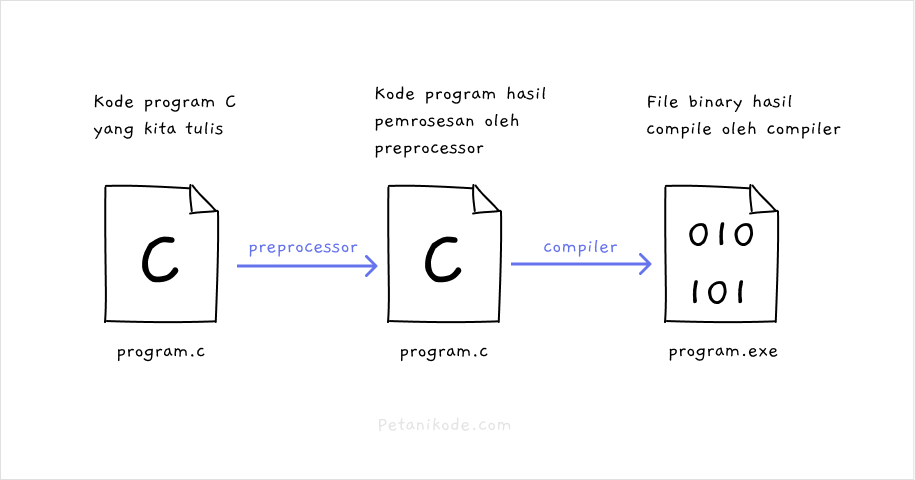

# Preprocessor dan Macro
## Apa itu Preprocessor dan Macro?
- Sebelum kode program di-compile menjadi binary, kode program diproses dulu oleh preprocessor.
- Hasil proses dari preprocessor berupa kode program C yang siap untuk di-compile.
  
- Mengapa harus dilakukan preprocessor?
- Agar kita tidak menulis kode secara manual.
  ```c
  #include <stdio.h>

  void main(){
    printf("Hello World!\n");
  }
  ```
- Pada program ini, terdapat sebuah macro:
  ```c
  #include <stdio.h>
  ```

- Fungsi macro ini untuk ngasi tau preprocessor supaya memasukkan semua kode yang ada di file stdio.h ke dalam kode program kita.
- Sehingga kita bisa menggunakan fungsi printf() di dalamnya.
- Jika tidak ada preprocessor, maka kita harus memasukkannya secara manual. Bisa dengan copas semua isi kode pada stdio.h ke dalam kode program kita.
- Mau seperti itu? Jelas tidak, ini pekerjaan yang melelahkan.
  - Karena itulah, kita membutuhkan preprocessor.

- jadi
- Preprocessor adalah proses yang dilakukan sebelum program di-compile berdasarkan macro yang diberikan. Hasil preprocessor adalah kode program, bukan file binary. Kode program inilah yang nantinya akan di-compile oleh compiler.
  
- Jika ingin melihat hasil preprocessor, kita bisa gunakan perintah cpp atau gcc -E.
  ```bash
  cpp hello_world.c
  # atau
  gcc -E hello_world.c
  ```
- Pada hasil preprocessor ini, semua kode yang ada di stdio.h dimasukkan ke dalam kode yang kita tulis.
- Ini karena kita menggunakan macro #include <stdio.h>.
- Macro adalah kode-kode untuk memberikan instruksi kepada preprocessor.
  ```c
  #include <stdio.h>
  ```
- Macro ini untuk memberi perintah ke preprocessor:
- “Hi preprocessor, masukan semua kode program yang ada di stdio.h ke dalam kode program ini”.
- Selain macro #include ada juga macro-macro yang lainnya.

| Macro Directive | Fungsi Macro                                    |
|-----------------|-------------------------------------------------|
| #define         | Mendefinisikan konstanta dan fungsi             |
| #include        | untuk menambahkan kode ke dalam program         |
| #undef          | untuk menghapus macro yang sudah didefinisikan  |
| #ifdef          | untuk mengecek apakah macro sudah didefinisikan |
| #ifndef         | untuk mengecek apakah macro belum didefinisikan |
| #if             | untuk membuat kondisi if                        |
| #else           | untuk membuat alternatif untuk if               |
| #elif           | untuk membuat kondisi else if                   |
| #endif          | untuk mengakhiri blok kondisi if                |
| #error          | untuk mencetak pesan error ke stderr            |
| #pragma         | untuk ngasi instruksi ke compiler.              |

- Macro directive adalah simbol-simbol atau kata-kata yang dipakai untuk membuat atau mendefinisikan macro.
- Pendefinisian macro dapat ditulis di mana saja, bisa di dalam fungsi main maupun di luar. Bisa di header file maupun source file.

## Directive #define dan #undefine
- ..direktif #define dan #undefine berfungsi untuk mendefinisikan dan menghapus definisi macro.
  ```c
  #define SCREEN_WIDTH 800
  #define SCREEN_HEIGHT 600
  ```
- Artinya:
  - Definisikan konstanta dengan nama SCREEN_WIDTH dengan nilai 800 dan SCREEN_HEIGH 600.

- Jika sebuah macro sudah didefinisikan di file lain, kita bisa definisikan ulang dengan menghapus definisinya terlebih dahulu dengan #undef.
- Selain mendefinisikan konstanta, direktif #define juga bisa kita pakai untuk mendefinisikan fungsi.
  ```c
  #define square(sisi) ((sisi) * (sisi))
  #define MAX(x,y) ((x) > (y) ? (x) : (y))
  ```
- Ada dua macro yang berbentuk fungsi yang kita buat, yakni: square() dan MAX().
- Jika ingin menggunakan macro tersebut, maka kita bisa panggil seperti fungsi biasa.

### contoh
```c
#include <stdio.h>

// mendefinisikan macro
#define MAX(x,y) ((x) > (y) ? (x) : (y))

int main(void) {
    // menggunakan macro
    printf("Max between 20 and 10 is %d\n", MAX(10, 20));  
    return 0;
}
```

- Jika di-compile dan dijalankan, maka hasil outputnya:
  ```c
  Max between 20 and 10 is 20
  ```
- Jadi direktif #define dan #undefine berfungsi untuk membuat dan menghapus macro.

## Predefined Macro
- Predefined macro adalah macro-macro yang sudah ada atau sudah didefinisikan di komputer kita. Kita tinggal pakai aja.
- Contoh predefined macro:
  - __DATE__ berisi tanggal saat ini;
  - __TIME__ berisi waktu saat ini;
  - __FILE__ berisi nama file dari kode program;
  - __LINE__ berisi nomor baris program.
  - __STDC__ berisi 1 jika program di-compile dengan standar ANSI.

### contoh
```c
#include <stdio.h>

void main() {

   printf("File : %s\n", __FILE__ );
   printf("Date : %s\n", __DATE__ );
   printf("Time : %s\n", __TIME__ );
   printf("Line : %d\n", __LINE__ );
   printf("ANSI : %d\n", __STDC__ );

}
```

## Direktif Kondisi
- Kita bisa membuat kondisi dengan direktif macro, ada beberapa direktif yang disediakan untuk membuat kondisi:

```c
#if untuk kondisi if;
#else untuk kondisi else;
#elif untuk kondisi else if;
#endif untuk menutup atau mengakhiri if;
#ifdef untuk mengecek jika macro sudah didefinisikan;
#ifndef untuk mengecek jika macro belum didefinisikan.
```

### contoh
```c
#include <stdio.h>

#ifndef DEBUG
#define DEBUG true
#endif

void main(){
  #if defined(DEBUG)
  printf("Debugging mode is on\n");
  #else
  printf("Debugging mode is off\n");
  #endif
}
```

- Jadi kita bisa memilih kode mana yang akan di proses berdasarkan kondisi tertentu.

# Operator pada Macro
- Macro punya 4 operator yang bisa dipakai:

## 1. Operator Sambungan
- Operator sambung menggunakan simbol backslash (\), fungsinya untuk menyambung definisi macro jika lebih dari satu baris.

### contoh
```c
#define  message_for(a, b)  \
printf(#a " and " #b ": We love you!\n")
```

## 2. Operator Stringize (#)
- Operator stringize menggunakan simbol pagar (#), berfungsi untuk mengubah parameter pada macro menjadi teks string.

### contoh
```c
#include <stdio.h>

#define  message_for(a, b)  \
    printf(#a " and " #b ": We love you!\n")

int main(void) {
    message_for(Petani, Kode);
    return 0;
}
```

- Mungkin kamu akan bertanya..
- Saat pakai macro seperti ini:
  ```c
  message_for(Petani, Kode);
  ```
- mengapa programnya tidak error, di sana kan gak ada tanda petik?
- Ingat:
  - Macro diproses oleh preprocessor, bukan compiler. Jadi saat di-compile programnya akan bisa jalan karena sebelumnya sudah dilakukan preprocessing.
- Kita bisa cek hasil preprocessor dengan perintah cpp.
  ```bash
  cpp kode_program.c
  ```

Maka hasilnya: \
```c
int main(void) {
    printf("Petani" " and " "Kode" ": We love you!\n");
    return 0;
}
```

## 3. Operator Token Pasting
- Operator token pasting berfungsi untuk mengambil nama variabel atau parameter yang diberikan ke macro. Operator ini menggunakan simbol pagar ganda (##).

### contoh
```c
#include <stdio.h>

#define tokenpaster(n) printf ("%d", token_##n)

int main(void) {
   int petani_kode = 40;
   tokenpaster(petani_kode);
   return 0;
}
```

Maka hasil preprocessor-nya: \
```c
int main(void) {
    int petani_kode = 40;
    printf ("%d", token_petani_kode);
    return 0;
}
```

## 4. Operator defined()
- Operator defined() berfungsi untuk mengecek kondisi suatu macro. Apakah macro tersebut sudah didefinisikan atau tidak. Ini sama seperti direktif #ifdef dan #ifndef.

### contoh
```c
#include <stdio.h>

#if !defined (MESSAGE)
   #define MESSAGE "You wish!"
#endif

int main(void) {
   printf("Here is the message: %s\n", MESSAGE);  
   return 0;
}
```

Maka hasil preprocessor-nya: \
```c
int main(void) {
   printf("Here is the message: %s\n", "You wish!");
   return 0;
}
```

# Parameter untuk Macro
- Parameter adalah variabel khusus yang dipakai oleh macro untuk diproses. Biasanya kita butuhkan saat membuat macro berbentuk fungsi.

### contoh
```c
#include <stdio.h>

#define MAX(x,y) ((x) > (y) ? (x) : (y))

void main(void) {
   printf("Max between 20 and 10 is %d\n", MAX(10, 20));
   return 0;
}
```

Maka hasil preprocessor-nya: \
```c
void main(void) {
   printf("Max between 20 and 10 is %d\n", ((10) > (20) ? (10) : (20)));
   return 0;
}
```