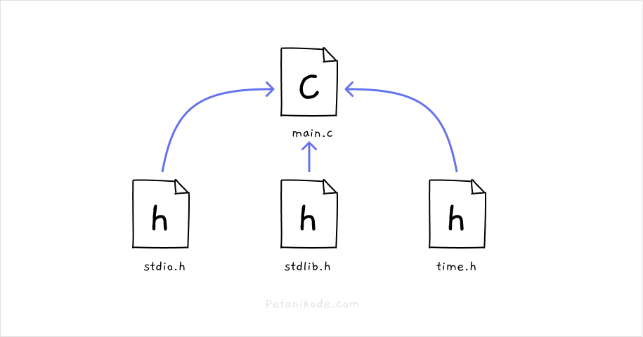
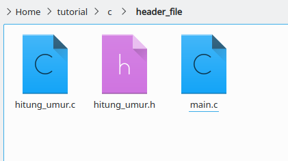
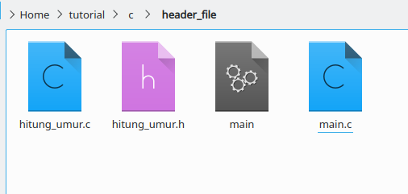

# Header File
- Header file adalah file dengan ekstensi .h yang berisi definisi dari fungsi, variabel, macro, dan konstanta.
- Pada program-program yang sudah kita buat, kita sering memasukkan header file stdio.h ke dalam program.
- File stdio.h adalah header file yang berisi definisi dari fungsi-fungsi untuk standar input dan output seperti printf(), scanf(), gets(), puts(), dan sebagainya.
- le stdio.h ada di mana?
  - Jika kamu pakai Linux, file stdio.h akan berada di direktori /usr/include/.
- Jika kamu pakai Windows, file stdio.h akan berada di folder compiler, misalnya C:\MinGw\include.
- Kita bisa membuka file stdio.h dengan teks editor dan melihat isinya.

## Mengapa kita Butuh Header File?
- Header file pada C sebenarnya berperan sebagai library.
- Apa itu library? Library dalam pemrograman adalah sekumpulan fungsi-fungsi dan konstanta yang bisa kita pakai kembali.
- Misalnya:
  - Kita sedang membuat program sekala besar. Program ini punya kode yang sangat banyak sampai ribuan. Maka kita tidak mungkin akan menulis program tersebut dalam satu file saja.
- Biar gampang dikelola, program harus dibuat menjadi modul atau library dengan menulisnya di file yang terpisah.
  

- Dengan begitu, kita hanya perlu mengimpor dan menggunakannya pada program utama.
- Jadi mengapa kita membutuhkan header file?
  - Karena agar bisa membuat program secara modular sehingga program tersebut gampang dikelola dan dikembangkan.

## Cara Impor Header File
- Ada dua cara mengimpor header file ke dalam program.

### Cara pertama: Menggunakan kurung sudut
```c
#inlude <stdio.h>
```
- Ini digunakan untuk mengimpor header file yang berada di folder sistem (/usr/include).

### Cara kedua: Menggunakan tanda petik
```c
#include "nama_file.h"
```
- Cara kedua digunakan untuk mengimpor header file yang masih satu folder dengan program kita.

---
## Latihan: Contoh Program dengan Header File
- Buatlah folder baru dengan nama header_file, kemudian di dalamnya buat tiga file
  - File main.c program utama;
  - File hitung_umur.h header file hitung umur;
  - File hitung_umur.c kode implementasi dari header file.



### File: hitung_umur.h
```c
int hitung_umur(int tahun_lahir, int tahun_sekarang);
```

### File: hitung_umur.c
```c
int hitung_umur(int tahun_lahir, int tahun_sekarang) {
  return tahun_sekarang - tahun_lahir;
} 
```

### File: main.c
```c
#include <stdio.h>
#include "hitung_umur.h"

void main() {
    int tahun_sekarang = 2022;
    int tahun_lahir = 1999;
    
    // menggunakan fungsi dari hitung_umur.h
    int umur = hitung_umur(tahun_lahir, tahun_sekarang);
    
    printf("Umur kamu %d tahun", umur);
} 
```

- Setelah itu, kita bisa compile semua programnya
- Karena di sini ada dua file kode file c, maka kita harus meng-compile kedua file tersebut.
  - Jika hanya meng-compile main.c saja, maka tidak akan bisa.

- Lalu gimana cara compile kedua file ini?
  - Caranya tinggal ditambahkan aja semua nama file yang mau di-compile pada perintah gcc.

- Contoh:
  ```bash
  gcc main.c hitung_umur.c -o main
  ```

- Maka hasilnya:
  

- Program berhasil di-compile, untuk menjalankannya ketik perintah berikut:
  ```bash
  ./main
  ```

## Latihan: Menggunakan Codeblocks
- 